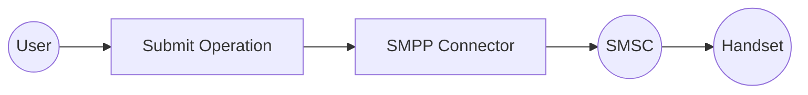

# Example

## What you'll build

Build an automation that connects to an SMSC over SMPP and sends one SMS to a phone number. The connection binds the SMSC host, system ID, and password to configurable variables, so you can point the same integration at any carrier or aggregator without editing the flow. The automation requests a delivery receipt, then logs the message ID the SMSC assigned.

**Operations used:**
- **Submit** : Sends a text message to one destination (`submit_sm`) and returns the message ID assigned by the SMSC

## Architecture

## Prerequisites

- An SMSC, carrier, or aggregator account that exposes SMPP, reachable from your integration environment on its SMPP port (`2775` is the common default)
- The bind credentials for that account: the system ID and password
- An account allowed to bind as `TRANSMITTER` or `TRANSCEIVER`, since the automation sends messages

See the [Setup Guide](setup-guide.md) for how to obtain these from your provider.

## Setting up the SMPP integration

> **New to WSO2 Integrator?** Follow the [Create a New Integration](product://integrator/develop-and-test/create-workspace) guide to set up your integration first, then return here to add the connector.

## Adding the SMPP connector

Add a connection to the SMSC first; the automation you build later sends through it.

### Step 1: Open the connector palette and search for the connector

1. Select **Add Artifact** on the integration's **Design** view, then select **Connection** under **Other Artifacts**.
2. Enter `smpp` in the **Search connectors** field.
3. Select the **Smpp** connector card.

> **Note:** The search also returns **Smpp Caller**, which is used inside a listener service to reply on the session a message arrived on. Select **Smpp** to create a client connection.

<ThemedImage
    alt="Add Connection palette filtered to smpp, showing the Smpp and Smpp Caller connector cards before selection"
    sources={{
        light: useBaseUrl('/img/connectors/catalog/messaging/smpp/smpp_screenshots_01_palette.png'),
        dark: useBaseUrl('/img/connectors/catalog/messaging/smpp/smpp_screenshots_01_palette.png'),
    }}
/>

## Configuring the SMPP connection

The connection form takes the SMSC endpoint and the bind credentials. Bind each value to a configurable so the same flow works against any provider.

### Step 2: Fill in the connection parameters

Bind each field to a configurable variable rather than entering a literal, so credentials never reach source control. For each field, open the helper panel, select **Configurables**, select **New Configurable**, enter the name and type, and select **Save**.

- **Host** : The SMSC host name or IP address; bind to `smscHost`
- **System Id** : The SMPP `system_id` (username) used to bind; bind to `systemId`
- **Password** : The password used to bind; bind to `password`
- **Advanced Configurations** : Expand this section to bind the **Port** to `smscPort` and set **Bind Type** to `TRANSMITTER`, since this automation only sends
- **Connection Name** : Enter `smppClient`; the flow references the connection by this name

<ThemedImage
    alt="SMPP connection form with Host, System Id, and Password bound to configurable variables, before saving"
    sources={{
        light: useBaseUrl('/img/connectors/catalog/messaging/smpp/smpp_screenshots_02_connection_form.png'),
        dark: useBaseUrl('/img/connectors/catalog/messaging/smpp/smpp_screenshots_02_connection_form.png'),
    }}
/>

### Step 3: Save the connection

Select **Save** on the connection form. The `smppClient` connection appears in the project tree and on the **Design** view.

<ThemedImage
    alt="Design view showing the saved smppClient connection"
    sources={{
        light: useBaseUrl('/img/connectors/catalog/messaging/smpp/smpp_screenshots_03_connections_list.png'),
        dark: useBaseUrl('/img/connectors/catalog/messaging/smpp/smpp_screenshots_03_connections_list.png'),
    }}
/>

### Step 4: Set actual values for your configurables

1. In the left panel, select **Configurations**.
2. Set a value for each configurable listed below before you run the integration.

- **smscHost** (string) : Host name or IP address of the SMSC
- **smscPort** (int) : The SMSC's SMPP port; defaults to `2775`
- **systemId** (string) : The system ID the SMSC issued for your account
- **password** (string) : The password for that system ID
- **destinationNumber** (string) : The recipient's number in international format without a leading `+`, for example `94771234567`

## Configuring the SMPP Submit operation

With the connection saved, create an automation and add the Submit operation to its flow.

### Step 5: Add an automation entry point

1. In the left panel under **Entry Points**, select **+** (**Add Entry Point**).
2. Under **Automation**, select **Automation**.
3. In the **Create New Automation** dialog, accept the default settings and select **Create**.

The canvas switches to the Automation flow view, showing a **Start** node, an **Error Handler** node, and an **End** node.

### Step 6: Select and configure the Submit operation

Select the **+** drop zone between **Start** and **Error Handler** on the canvas to open the **Add Step** panel. Expand the **smppClient** connection to reveal its operations.

<ThemedImage
    alt="Add Step panel with the smppClient connection expanded, listing the Submit, Submit Multi, Submit Data, Query Status, Cancel, Replace, and Close operations"
    sources={{
        light: useBaseUrl('/img/connectors/catalog/messaging/smpp/smpp_screenshots_04_operations_panel.png'),
        dark: useBaseUrl('/img/connectors/catalog/messaging/smpp/smpp_screenshots_04_operations_panel.png'),
    }}
/>

Select **Submit** to open the **smppClient → submit** configuration form, then configure the following fields:

- **Sms** : The message to send. Open the helper panel, select **Configurables**, select **New Configurable**, and create `destinationNumber` (type `string`) for the recipient's number. Then switch the field to **Expression** mode and enter a `TextSms` record that addresses the message to that configurable and requests a delivery receipt: `{destinationAddress: destinationNumber, shortMessage: "Hello from WSO2 Integrator!", registeredDelivery: smpp:ON_SUCCESS_OR_FAILURE}`
- **Result** : Enter `result`; the SMSC's message ID is returned in `result.messageId`

<ThemedImage
    alt="Submit operation form with the Sms record expression entered and the result variable named, before saving"
    sources={{
        light: useBaseUrl('/img/connectors/catalog/messaging/smpp/smpp_screenshots_05_operation_form.png'),
        dark: useBaseUrl('/img/connectors/catalog/messaging/smpp/smpp_screenshots_05_operation_form.png'),
    }}
/>

Select **Save**. The `smpp : submit` node is added to the Automation flow. Then add a **Log Info** step after the operation with the message `SMS submitted to the SMSC` and `result.messageId` as an additional value, so the ID can be correlated with the delivery receipt later.

<ThemedImage
    alt="Completed automation flow showing Start, the smpp submit operation bound to smppClient, the log step, and the Error Handler"
    sources={{
        light: useBaseUrl('/img/connectors/catalog/messaging/smpp/smpp_screenshots_06_completed_flow.png'),
        dark: useBaseUrl('/img/connectors/catalog/messaging/smpp/smpp_screenshots_06_completed_flow.png'),
    }}
/>

## Try it yourself

Try this sample in WSO2 Integration Platform.

[View source on GitHub](https://github.com/wso2/integration-samples/tree/main/integrator-default-profile/connectors/smpp_connector_sample)

## More code examples

The `smpp` module provides practical examples illustrating usage in various scenarios.

- [**Send an SMS**](https://github.com/ballerina-platform/module-ballerina-smpp/tree/main/examples/send-sms): Binds a transmitter client, submits a single text message with a delivery-receipt request, and prints the message ID the SMSC returns.
- [**Receive SMS and delivery receipts**](https://github.com/ballerina-platform/module-ballerina-smpp/tree/main/examples/receive-sms): Binds a receiver listener and logs every inbound message and delivery receipt, including the receipt's final status.
- [**Two-way SMS short code**](https://github.com/ballerina-platform/module-ballerina-smpp/tree/main/examples/two-way-sms): Binds a transceiver listener that answers a balance-enquiry keyword by replying on the same session through the `Caller`.
