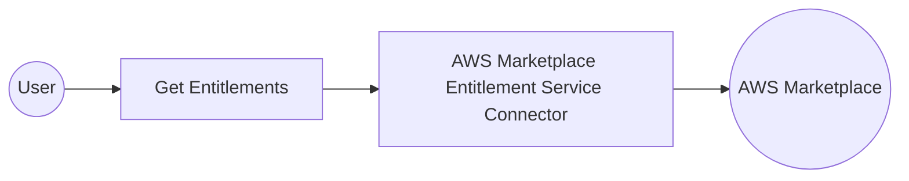

# Example

## What you'll build

This example builds an automation that retrieves the entitlements customers hold for one of your AWS Marketplace products. The automation runs on demand, queries the Entitlement Service through the connector, and logs the entitlement records it receives. Credentials and the product code stay in configurable variables, so the integration holds no sensitive values.

**Operations used:**
- **Get Entitlements** : Retrieves the entitlement values for a given product.

## Architecture

## Prerequisites

- An AWS account registered as a seller in the AWS Marketplace Management Portal.
- A published product on an entitlement-based pricing model, such as a SaaS contract.
- At least one customer subscription against that product.
- An IAM user with an access key ID and a secret access key.
- The product code that identifies your product in AWS Marketplace.

## Setting up the AWS Marketplace Entitlement Service integration

> **New to WSO2 Integrator?** Follow the [Create a New Integration](../../../../develop/create-integrations/create-a-new-integration.md) guide to set up your integration first, then return here to add the connector.

## Adding the AWS Marketplace Entitlement Service connector

### Step 1: Open the connector palette

Select **Add Connection** in the **Connections** section.

### Step 2: Select the AWS Marketplace Entitlement Service connector

1. Enter `aws.marketplace.mpe` in the search field.
2. Select the **Mpe** connector card.

> **Note:** The card and the connection form both use the short module name **Mpe** for the AWS Marketplace Entitlement Service.

## Configuring the AWS Marketplace Entitlement Service connection

### Step 3: Bind the connection parameters to configurable variables

Bind each required connection field to a configurable variable so that the integration stores no credential. Keep the default authentication style, which uses a static access key pair, and keep the default connection name **mpeClient**.

- **Auth** : Authentication details that identify the caller to AWS
- **Region** : AWS region that serves the Entitlement Service requests

### Step 4: Save the connection

Select **Save Connection** and verify that the connection appears in the **Connections** section.

### Step 5: Set actual values for your configurables

1. Select **Configurations** at the bottom of the project tree under **Data Mappers**.
2. Enter a value for each configurable variable listed below before you run the integration.

- **region** (`string`) : AWS region for the Entitlement Service endpoint
- **accessKeyId** (`string`) : Access key ID of the IAM user
- **secretAccessKey** (`string`) : Secret access key of the IAM user
- **productCode** (`string`) : Product code of your AWS Marketplace product, added with the operation in Step 7

## Configuring the AWS Marketplace Entitlement Service Get Entitlements operation

### Step 6: Add an automation entry point

1. Select **Add Entry Point** next to **Entry Points**.
2. Select **Automation**.
3. Select **Create** to accept the settings.

### Step 7: Expand the connection and configure the Get Entitlements operation

1. Select **+** between **Start** and **Error Handler** in the automation flow.
2. Expand **mpeClient** to display its operations.

3. Select **Get Entitlements** and enter its required values.

- **Product Code** : Product that entitlements are requested for, bound to a configurable variable
- **Result** : Name of the variable that holds the entitlements response

4. Select **Save**.

### Step 8: Log the Get Entitlements result

1. Select **+** below the **Get Entitlements** node.
2. Expand **Logging** and select **Log Info**.
3. Set **Msg** to the operation result, then select **Save**.

## Try it yourself

Try this sample in WSO2 Integration Platform.

[View source on GitHub](https://github.com/wso2/integration-samples/tree/main/integrator-default-profile/connectors/aws.marketplace.mpe_connector_sample)

## More code examples

The `ballerinax/aws.marketplace.mpe` connector provides practical examples illustrating usage in various scenarios. Explore these [examples](https://github.com/ballerina-platform/module-ballerinax-aws.marketplace.mpe/tree/main/examples):

1. [**Retrieve entitlements**](https://github.com/ballerina-platform/module-ballerinax-aws.marketplace.mpe/tree/main/examples/retrieve-entitlements) – Retrieves the entitlements of customers who have subscribed to a product, and filters them by customer identifier and dimension.
