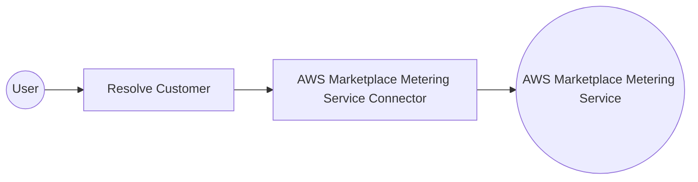

# Example

## What you'll build

This example resolves a buyer's registration token into a customer identifier. An automation entry point calls the AWS Marketplace Metering Service through the connector, then logs the resolved customer details. The credentials, region, and registration token all stay in configurable variables, so nothing sensitive is stored in the integration.

**Operations used:**
- **Resolve Customer** : Retrieves the customer details mapped to a registration token.

## Architecture

## Prerequisites

- An AWS account registered as a seller in the [AWS Marketplace Management Portal](https://aws.amazon.com/marketplace/management/), with a published consumption-based SaaS product.
- An IAM identity whose access key is allowed to call `aws-marketplace:ResolveCustomer`.
- A buyer registration token to resolve.

## Setting up the AWS Marketplace Metering Service integration

> **New to WSO2 Integrator?** Follow the [Create a New Integration](../../../../develop/create-integrations/create-a-new-integration.md) guide to set up your integration first, then return here to add the connector.

## Adding the AWS Marketplace Metering Service connector

### Step 1: Open the connector palette

Select **Add Connection** in the **Connections** section.

### Step 2: Select the AWS Marketplace Metering Service connector

1. Enter `aws.marketplace.mpm` in the search field.
2. Select the **Mpm** card listed under `ballerinax / aws.marketplace.mpm`.

## Configuring the AWS Marketplace Metering Service connection

### Step 3: Bind the connection parameters to configurable variables

Bind each required connection field to a configurable variable, and keep the default static-credential authentication.

- **Auth** : Credentials that sign every metering request.
- **Region** : AWS region that serves the metering requests.

### Step 4: Save the connection

Select **Save Connection**, then verify that `mpmClient` appears in the **Connections** section.

### Step 5: Set actual values for your configurables

1. Select **Configurations** at the bottom of the project tree under **Data Mappers**.
2. Enter a value for each configurable listed below before you run the integration.

- **region** (`string`) : AWS region that serves your metering requests, such as `us-east-1`.
- **awsAccessKeyId** (`string`) : Access key ID of the IAM identity allowed to call the metering APIs.
- **awsSecretAccessKey** (`string`) : Secret access key paired with that access key ID.
- **registrationToken** (`string`) : Registration token that the buyer provided.

## Configuring the AWS Marketplace Metering Service Resolve Customer operation

### Step 6: Add an automation entry point

1. Select **Add Entry Point** next to **Entry Points**.
2. Select **Automation**.
3. Select **Create** to accept the default settings.

### Step 7: Expand the connection and configure the Resolve Customer operation

1. Select the **+** node between **Start** and **Error Handler** in the automation flow.
2. Expand **mpmClient** to display its operations.

3. Select **Resolve Customer** and enter its required values.

- **Registration Token** : Buyer registration token to resolve into a customer identifier.
- **Result** : Name of the variable that receives the resolved customer details.

4. Select **Save**.

### Step 8: Log the Resolve Customer result

Add a **Log Info** action after the operation to surface the resolved customer details, then return to the visual flow.

## Try it yourself

Try this sample in WSO2 Integration Platform.

[View source on GitHub](https://github.com/wso2/integration-samples/tree/main/integrator-default-profile/connectors/aws.marketplace.mpm_connector_sample)

## More code examples

The `ballerinax/aws.marketplace.mpm` connector provides practical examples illustrating usage in various scenarios. Explore these [examples](https://github.com/ballerina-platform/module-ballerinax-aws.marketplace.mpm/tree/main/examples):

1. [**Meter usage**](https://github.com/ballerina-platform/module-ballerinax-aws.marketplace.mpm/tree/main/examples/meter-usage) – Resolves a buyer's registration token into a customer identifier, and reports the usage accumulated for that customer against a product dimension.
