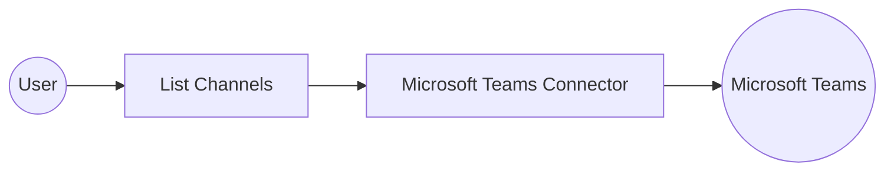

# Example

## What you'll build

This integration connects to Microsoft Teams and retrieves the channels that belong to a team. An automation runs the flow, calls the connector, and logs the returned channel collection. You'll bind every credential to a configurable variable, so no secret is stored in the integration itself.

**Operations used:**
- **List Channels** : Retrieves the collection of channels in the specified team.

## Architecture

## Prerequisites

- A Microsoft 365 account with access to Microsoft Teams.
- An application registered in Microsoft Entra ID, with a client secret and admin-consented Microsoft Graph application permissions.
- The directory (tenant) ID of your organization, which forms the OAuth2 token endpoint.

## Setting up the Microsoft Teams integration

> **New to WSO2 Integrator?** Follow the [Create a New Integration](../../../../develop/create-integrations/create-a-new-integration.md) guide to set up your integration first, then return here to add the connector.

## Adding the Microsoft Teams connector

### Step 1: Open the connector palette

Select **Add Connection** in the **Connections** section.

### Step 2: Select the Microsoft Teams connector

1. Enter `microsoft.teams` in the search field.
2. Select the **Teams** connector card.

## Configuring the Microsoft Teams connection

### Step 3: Bind the connection parameters to configurable variables

Switch **Config** to expression mode, then bind each authentication value to a configurable variable.

- **Config** : The configuration used to initialize the connector, holding the OAuth2 client credentials.
- **Connection Name** : The name that identifies this connection across the integration.

### Step 4: Save the connection

Select **Save Connection** and verify that the connection appears in the **Connections** section.

### Step 5: Set actual values for your configurables

1. Select **Configurations** at the bottom of the project tree under **Data Mappers**.
2. Enter a value for each configurable listed below before you run the integration.

- **tokenUrl** (`string`) : The Microsoft Entra ID OAuth2 token endpoint for your tenant.
- **clientId** (`string`) : The application (client) ID of your registered application.
- **clientSecret** (`string`) : The client secret generated for your registered application.
- **teamId** (`string`) : The unique identifier of the team whose channels you want to list.

## Configuring the Microsoft Teams List Channels operation

### Step 6: Add an automation entry point

1. Select **Add Entry Point** next to **Entry Points**.
2. Select **Automation**.
3. Select **Create** to accept the settings.

### Step 7: Expand the connection and configure the List Channels operation

1. Select the **+** node between **Start** and **Error Handler**.
2. Expand **teamsClient** to display its operations.

3. Select **List Channels** and enter its required values.

- **Team Id** : The unique identifier of the team, bound to a configurable variable.
- **Result** : The name of the variable that holds the returned channel collection.
- **Result Type** : The response type of the operation, which the editor sets for you.

4. Select **Save**.

### Step 8: Log the List Channels result

1. Select the **+** node between **List Channels** and **Error Handler**.
2. Expand **Logging**, then select **Log Info**.
3. Switch **Msg** to expression mode and reference the result variable.
4. Select **Save** to return to the visual flow.

## Try it yourself

Try this sample in WSO2 Integration Platform.

[View source on GitHub](https://github.com/wso2/integration-samples/tree/main/integrator-default-profile/connectors/microsoft.teams_connector_sample)

## More code examples

The `Microsoft Teams` connector provides practical examples illustrating usage in various scenarios. Explore these [examples](https://github.com/ballerina-platform/module-ballerinax-microsoft.teams/tree/main/examples), covering the following use cases:

1. [Team and channel setup](https://github.com/ballerina-platform/module-ballerinax-microsoft.teams/tree/main/examples/team-and-channel-setup) — Provision a new team and create a channel within it.
2. [Channel message thread](https://github.com/ballerina-platform/module-ballerinax-microsoft.teams/tree/main/examples/channel-message-thread) — Post a message to a channel, reply to it, and add a reaction.
3. [Channel member management](https://github.com/ballerina-platform/module-ballerinax-microsoft.teams/tree/main/examples/channel-member-management) — Create a private channel with an owner and list its members.
4. [Team tag management](https://github.com/ballerina-platform/module-ballerinax-microsoft.teams/tree/main/examples/team-tag-management) — Create a teamwork tag on a team and list all its tags.
