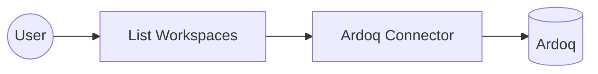

# Example

## What you'll build

This example builds an automation that connects to Ardoq and lists every workspace in your organization. The automation calls the **List Workspaces** operation and logs the result.

**Operations used:**
- **List Workspaces** : Retrieves the workspaces visible to the authenticated user.

## Architecture

## Prerequisites

- An Ardoq API token. See the connector's [Setup Guide](setup-guide.md).

## Setting up the Ardoq integration

> **New to WSO2 Integrator?** Follow the [Create a New Integration](../../../../develop/create-integrations/create-a-new-integration.md) guide to set up your integration first, then return here to add the connector.

## Adding the Ardoq connector

### Step 1: Open the connector palette

Select **Add Connection** in the **Connections** section.

### Step 2: Select the Ardoq connector

Enter "ardoq" in the search box to filter the connector list, then select the **Ardoq** connector card (`ballerinax/ardoq`) to open its connection configuration form.

## Configuring the Ardoq connection

### Step 3: Bind the connection parameters to configurable variables

Bind the required connection field to a configurable variable.

- **Token** : The Ardoq API token used to authenticate every request.
- **Service URL** : The base URL of the Ardoq API. Defaults to `https://app.ardoq.com/api/v2`; override it if your organization uses a dedicated Ardoq subdomain.

### Step 4: Save the connection

Select **Save** and verify that the connection appears in the **Connections** section.

### Step 5: Set actual values for your configurables

1. Select **Configurations** at the bottom of the project tree under **Data Mappers**.
2. Enter a value for each configurable listed below before you run the integration.

- **token** (`string`) : Your Ardoq API token.
- **serviceUrl** (`string`) : The base URL of the Ardoq API. Defaults to `https://app.ardoq.com/api/v2`.

## Configuring the Ardoq List Workspaces operation

### Step 6: Add an automation entry point

1. In the low-code canvas, select **Add Artifact** in the Design section.
2. Select **Automation** in the artifact selection panel.
3. Accept the default schedule settings and select **Create** to add the automation to the canvas.

### Step 7: Expand the Ardoq connection and select the List Workspaces operation

1. In the automation flow body on the canvas, select the **+** (Add Step) button between the Start and Error Handler nodes to open the step-addition panel.
2. Under **Connections** in the step panel, select the **ardoqClient** connection node to expand it and reveal all available Ardoq API operations.

3. Select **List Workspaces** from the list. This operation has no required parameters, so only the result variable needs a name.

- **Result** : The name of the variable that holds the returned workspaces.

4. Select **Save** to add the Ardoq operation step to the automation flow.

### Step 8: Log the List Workspaces result

Add a log action for the returned value, then return to the visual flow.

## Try it yourself

Try this sample in WSO2 Integration Platform.

[View source on GitHub](https://github.com/wso2/integration-samples/tree/main/integrator-default-profile/connectors/ardoq_connector_sample)

## More code examples

The `Ardoq` connector offers practical examples illustrating its use in various scenarios.
Explore these [examples](https://github.com/ballerina-platform/module-ballerinax-ardoq/tree/main/examples/), covering the following use cases:

1. [Application dependency mapping](https://github.com/ballerina-platform/module-ballerinax-ardoq/tree/main/examples/application-dependency-mapping): Find a workspace by name, discover its model types, create two application components, and link them with a dependency reference.
2. [Report results export](https://github.com/ballerina-platform/module-ballerinax-ardoq/tree/main/examples/report-results-export): Find a report by name, fetch its definition to show the configured columns, then run the report and print the results in tabular format.
