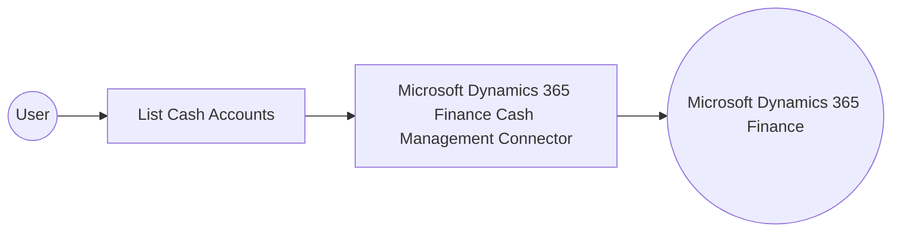

# Example

## What you'll build

This integration retrieves cash account records from a Microsoft Dynamics 365 Finance environment using the Microsoft Dynamics 365 Finance Cash Management connector. The flow calls the **List Cash Accounts** operation and logs the result as a JSON string.

**Operations used:**
- **List Cash Accounts** : Lists cash account records used to manage and reconcile an organization's cash positions

## Architecture

## Prerequisites

- A Microsoft Dynamics 365 Finance & Operations environment with the Cash and bank management module configured
- A Microsoft Entra ID app registration with Dynamics 365 API permissions, added as a user in the Dynamics 365 Finance environment

- The application must be registered as a user in the target Dynamics 365 Finance and Operations environment and assigned the security roles required for this connector's operations.

## Setting up the Microsoft Dynamics 365 Finance Cash Management integration

> **New to WSO2 Integrator?** Follow the [Create a New Integration](../../../../develop/create-integrations/create-a-new-integration.md) guide to set up your integration first, then return here to add the connector.

## Adding the Microsoft Dynamics 365 Finance Cash Management connector

### Step 1: Open the connector palette

Select **Add Connection** in the **Connections** section.

### Step 2: Select the Microsoft Dynamics 365 Finance Cash Management connector

1. Enter `microsoft.dynamics365.finance.cashmanagement` in the search field.
2. Select the **Cashmanagement** connector card.

## Configuring the Microsoft Dynamics 365 Finance Cash Management connection

### Step 3: Bind the connection parameters to configurable variables

Bind every required connection field to a configurable variable:

- **Config** : Authentication object referencing the `tokenUrl`, `clientId`, `clientSecret`, and `scopes` configurable variables. Enter the expression `{auth: {tokenUrl, clientId, clientSecret, scopes}}`.
- **Service Url** : URL of the target Dynamics 365 Finance and Operations environment, bound to the `serviceUrl` configurable variable. Use the OData root, for example `https://<your-org>.operations.dynamics.com/data`.
- **Connection Name** : Set to `cashmanagementClient`

### Step 4: Save the connection

Select **Save Connection** and verify that the connection appears in the **Connections** section.

### Step 5: Set actual values for your configurables

1. Select **Configurations** at the bottom of the project tree under **Data Mappers**.
2. Enter a value for each configurable listed below before you run the integration.

- **tokenUrl** (`string`) : The Microsoft identity platform token endpoint for your tenant
- **clientId** (`string`) : The application (client) ID of your Microsoft Entra ID app registration
- **clientSecret** (`string`) : The client secret generated for your Microsoft Entra ID app registration
- **scopes** (`string[]`) : The OAuth2 scope requested for the client-credentials token, set to the environment base URL followed by `/.default`
- **serviceUrl** (`string`) : The OData root URL of your Dynamics 365 Finance and Operations environment

## Configuring the Microsoft Dynamics 365 Finance Cash Management List Cash Accounts operation

### Step 6: Add an automation entry point

1. Select **Add Entry Point** next to **Entry Points**.
2. Select **Automation**.
3. Select **Create** to accept the settings.

### Step 7: Expand the connection and configure the List Cash Accounts operation

1. Select the **+** icon on the automation flow to open the node panel.
2. Expand **cashmanagementClient** under **Connections** to display its operations.

3. Select **List Cash Accounts**. This operation has no required parameters; the result is stored in the `cashmanagementCashaccountscollection` variable (`cashmanagement:CashAccountsCollection`).

4. Select **Save**.

### Step 8: Log the List Cash Accounts result

Add a **Log Info** action that logs `cashmanagementCashaccountscollection.toJsonString()`, then return to the visual flow.

## Try it yourself

Try this sample in WSO2 Integration Platform.

[View source on GitHub](https://github.com/wso2/integration-samples/tree/main/integrator-default-profile/connectors/microsoft_dynamics365_finance_cashmanagement_connector_sample)

## More code examples

The Dynamics 365 Finance Ballerina connectors provide practical examples illustrating usage in various scenarios.
Explore these [examples](https://github.com/ballerina-platform/module-ballerinax-microsoft.dynamics365.finance/tree/main/examples).
