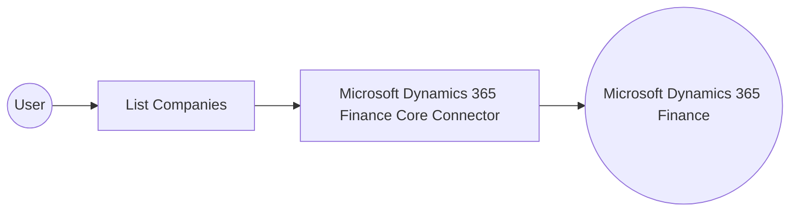

# Example

## What you'll build

This example builds an automation that connects to Microsoft Dynamics 365 Finance and retrieves the companies configured in the target environment. The integration binds the connection's authentication settings to configurable variables and logs the retrieved collection so you can verify the result.

**Operations used:**
- **List Companies** : Retrieves the collection of companies available in the target Microsoft Dynamics 365 Finance and Operations environment.

## Architecture

## Prerequisites

- A Microsoft Dynamics 365 Finance and Operations environment, cloud-hosted or sandbox.
- An Azure Active Directory (Entra ID) app registration with API permissions for Dynamics 365, providing a token URL, a client ID, and a client secret.

- The application must be registered as a user in the target Dynamics 365 Finance and Operations environment and assigned the security roles required for this connector's operations.

## Setting up the Microsoft Dynamics 365 Finance Core integration

> **New to WSO2 Integrator?** Follow the [Create a New Integration](../../../../develop/create-integrations/create-a-new-integration.md) guide to set up your integration first, then return here to add the connector.

## Adding the Microsoft Dynamics 365 Finance Core connector

### Step 1: Open the connector palette

Select **Add Connection** in the **Connections** section.

### Step 2: Select the Microsoft Dynamics 365 Finance Core connector

1. Enter `Microsoft Dynamics 365 Finance Core` in the search field.
2. Select the **Microsoft Dynamics 365 Finance Core** connector card.

## Configuring the Microsoft Dynamics 365 Finance Core connection

### Step 3: Bind the connection parameters to configurable variables

1. Switch **Config** to expression mode and bind it to an expression that references configurable variables for the token URL, the client ID, and the client secret.
2. Bind **Service Url** to a configurable variable for the target environment endpoint.
3. Enter `coreClient` as the **Connection Name**.

- **Config** : The authentication settings used to initialize the connector. Enter the expression `{auth: {tokenUrl, clientId, clientSecret, scopes}}`.
- **Service Url** : The base URL of the target Microsoft Dynamics 365 Finance and Operations environment. Use the OData root, for example `https://<your-org>.operations.dynamics.com/data`.

### Step 4: Save the connection

Select **Save Connection** and verify that `coreClient` appears in the **Connections** section.

### Step 5: Set actual values for your configurables

1. Select **Configurations** at the bottom of the project tree under **Data Mappers**.
2. Enter a value for each configurable listed below before you run the integration.

- **tokenUrl** (`string`) : The OAuth2 token endpoint URL for the Azure Active Directory application.
- **clientId** (`string`) : The application (client) ID of the registered Azure Active Directory application.
- **clientSecret** (`string`) : The client secret generated for the Azure Active Directory application.
- **scopes** (`string[]`) : The OAuth2 scope requested for the client-credentials token, set to the environment base URL followed by `/.default`
- **serviceUrl** (`string`) : The base URL of the target Microsoft Dynamics 365 Finance and Operations environment.

## Configuring the Microsoft Dynamics 365 Finance Core List Companies operation

### Step 6: Add an automation entry point

1. Select **Add Entry Point** next to **Entry Points**.
2. Select **Automation**.
3. Select **Create** to accept the settings.

### Step 7: Expand the connection and configure the List Companies operation

1. Select **Add Step** in the automation flow.
2. Expand **coreClient** to display its operations.

3. Select **List Companies**. This operation has no required fields.

- **Result** : Keep the generated `coreCompaniescollection` result variable, which holds the returned `core:CompaniesCollection`.

4. Select **Save**.

### Step 8: Log the List Companies result

Add a **Log Info** action, switch its **Msg** field to expression mode, and enter `coreCompaniescollection.toJsonString()` to log the result. Return to the visual flow to confirm the complete chain.

## Try it yourself

Try this sample in WSO2 Integration Platform.

[View source on GitHub](https://github.com/wso2/integration-samples/tree/main/integrator-default-profile/connectors/microsoft_dynamics365_finance_core_connector_sample)

## More code examples

The Dynamics 365 Finance Ballerina connectors provide practical examples illustrating usage in various scenarios.
Explore these [examples](https://github.com/ballerina-platform/module-ballerinax-microsoft.dynamics365.finance/tree/main/examples).
