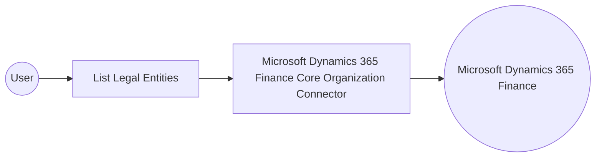

# Example

## What you'll build

This example builds an automation that connects to Microsoft Dynamics 365 Finance Core Organization and retrieves the collection of legal entities configured in the target environment. The automation authenticates with OAuth2 client credentials, runs the list operation, and logs the returned collection as JSON.

**Operations used:**
- **List Legal Entities** : Retrieves the collection of legal entities defined in the Microsoft Dynamics 365 Finance environment.

## Architecture

## Prerequisites

- A Microsoft Dynamics 365 Finance and Operations environment, either cloud-hosted or sandbox.
- An Azure Active Directory (Entra ID) application registration with API permissions for Dynamics 365, including a client ID, a client secret, and a token URL for the OAuth2 client credentials flow.

- The application must be registered as a user in the target Dynamics 365 Finance and Operations environment and assigned the security roles required for this connector's operations.

## Setting up the Microsoft Dynamics 365 Finance Core Organization integration

> **New to WSO2 Integrator?** Follow the [Create a New Integration](../../../../develop/create-integrations/create-a-new-integration.md) guide to set up your integration first, then return here to add the connector.

## Adding the Microsoft Dynamics 365 Finance Core Organization connector

### Step 1: Open the connector palette

Select **Add Connection** in the **Connections** section.

### Step 2: Select the Microsoft Dynamics 365 Finance Core Organization connector

1. Enter `microsoft.dynamics365.finance.coreorg` in the search field.
2. Select the **Coreorg** connector card.

## Configuring the Microsoft Dynamics 365 Finance Core Organization connection

### Step 3: Bind the connection parameters to configurable variables

Bind every required connection field to a configurable variable:

- **Config** : Authentication object referencing the `tokenUrl`, `clientId`, `clientSecret`, and `scopes` configurable variables. Enter the expression `{auth: {tokenUrl, clientId, clientSecret, scopes}}`.
- **Service Url** : URL of the target Dynamics 365 Finance and Operations environment, bound to the `serviceUrl` configurable variable. Use the OData root, for example `https://<your-org>.operations.dynamics.com/data`.
- **Connection Name** : Set to `coreorgClient`

### Step 4: Save the connection

Select **Save Connection** and verify that the connection appears in the **Connections** section.

### Step 5: Set actual values for your configurables

1. Select **Configurations** at the bottom of the project tree under **Data Mappers**.
2. Enter a value for each configurable listed below before you run the integration.

- **tokenUrl** (`string`) : The OAuth2 token endpoint used to obtain an access token for the client credentials grant.
- **clientId** (`string`) : The application (client) ID of the Azure Active Directory app registration.
- **clientSecret** (`string`) : The client secret of the Azure Active Directory app registration.
- **scopes** (`string[]`) : The OAuth2 scope requested for the client-credentials token, set to the environment base URL followed by `/.default`
- **serviceUrl** (`string`) : The base URL of the target Microsoft Dynamics 365 Finance and Operations environment.

## Configuring the Microsoft Dynamics 365 Finance Core Organization List Legal Entities operation

### Step 6: Add an automation entry point

1. Select **Add Entry Point** next to **Entry Points**.
2. Select **Automation**.
3. Select **Create** to accept the settings.

### Step 7: Expand the connection and configure the List Legal Entities operation

1. Select the **+** icon on the automation flow to open the node panel.
2. Expand **coreorgClient** under **Connections** to display its operations.

3. Select **List Legal Entities**. This operation has no required parameters; the result is stored in the `coreorgLegalentitiescollection` variable (`coreorg:LegalEntitiesCollection`).

4. Select **Save**.

### Step 8: Log the List Legal Entities result

Add a **Log Info** action that logs `coreorgLegalentitiescollection.toJsonString()`, then return to the visual flow.

## Try it yourself

Try this sample in WSO2 Integration Platform.

[View source on GitHub](https://github.com/wso2/integration-samples/tree/main/integrator-default-profile/connectors/microsoft_dynamics365_finance_coreorg_connector_sample)

## More code examples

The Dynamics 365 Finance Ballerina connectors provide practical examples illustrating usage in various scenarios.
Explore these [examples](https://github.com/ballerina-platform/module-ballerinax-microsoft.dynamics365.finance/tree/main/examples).
