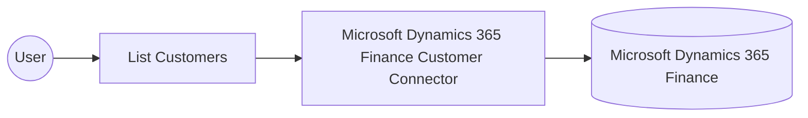

# Example

## What you'll build

This example builds an automation that connects to Microsoft Dynamics 365 Finance through the Customer connector and retrieves a collection of customer records. The automation logs the returned collection so you can confirm that the connection and the operation work end to end.

**Operations used:**
- **List Customers** : Retrieves a collection of customer records from Microsoft Dynamics 365 Finance.

## Architecture

## Prerequisites

- An Azure Active Directory (Entra ID) application registration with API permissions for Microsoft Dynamics 365 Finance.
- A Microsoft Dynamics 365 Finance and Operations environment with a known service URL.

- The application must be registered as a user in the target Dynamics 365 Finance and Operations environment and assigned the security roles required for this connector's operations.

## Setting up the Microsoft Dynamics 365 Finance Customer integration

> **New to WSO2 Integrator?** Follow the [Create a New Integration](../../../../develop/create-integrations/create-a-new-integration.md) guide to set up your integration first, then return here to add the connector.

## Adding the Microsoft Dynamics 365 Finance Customer connector

### Step 1: Open the connector palette

Select **Add Connection** in the **Connections** section.

### Step 2: Select the Microsoft Dynamics 365 Finance Customer connector

1. Enter `microsoft.dynamics365.finance.customer` in the search field.
2. Select the **Customer** connector card.

## Configuring the Microsoft Dynamics 365 Finance Customer connection

### Step 3: Bind the connection parameters to configurable variables

Bind every connection field to a configurable variable that supplies the OAuth2 client-credentials grant and the target environment endpoint.

- **Config** : Binds the token URL, client ID, and client secret configurable variables used for the OAuth2 client-credentials grant. Enter the expression `{auth: {tokenUrl, clientId, clientSecret, scopes}}`.
- **Service Url** : Binds the configurable variable for the Microsoft Dynamics 365 Finance and Operations environment endpoint. Use the OData root, for example `https://<your-org>.operations.dynamics.com/data`.

### Step 4: Save the connection

Select **Save Connection** and verify that **customerClient** appears in the **Connections** section.

### Step 5: Set actual values for your configurables

1. Select **Configurations** at the bottom of the project tree under **Data Mappers**.
2. Enter a value for each configurable listed below before you run the integration.

- **tokenUrl** (`string`) : The OAuth2 token endpoint used to obtain an access token for Microsoft Dynamics 365 Finance.
- **clientId** (`string`) : The client identifier of the Azure Active Directory application registration.
- **clientSecret** (`string`) : The client secret of the Azure Active Directory application registration.
- **scopes** (`string[]`) : The OAuth2 scope requested for the client-credentials token, set to the environment base URL followed by `/.default`
- **serviceUrl** (`string`) : The base URL of the target Microsoft Dynamics 365 Finance and Operations environment.

## Configuring the Microsoft Dynamics 365 Finance Customer List Customers operation

### Step 6: Add an automation entry point

1. Select **Add Entry Point** next to **Entry Points**.
2. Select **Automation**.
3. Select **Create** to accept the settings.

### Step 7: Expand the connection and select the List Customers operation

1. Select **Add Step** in the automation flow.
2. Expand **customerClient** to display its operations.

3. Select **List Customers**. This operation has no required parameters, and its result is stored in **customerCustomerscollection** (`customer:CustomersCollection`).

4. Select **Save**.

### Step 8: Log the List Customers result

1. Select **Add Step** on the connecting line to **Error Handler**.
2. Expand **Logging** and select **Log Info**.
3. Switch **Msg** to expression mode and enter `customerCustomerscollection.toJsonString()`.
4. Select **Save**.

## Try it yourself

Try this sample in WSO2 Integration Platform.

[View source on GitHub](https://github.com/wso2/integration-samples/tree/main/integrator-default-profile/connectors/microsoft_dynamics365_finance_customer_connector_sample)

## More code examples

The Dynamics 365 Finance Ballerina connectors provide practical examples illustrating usage in various scenarios.
Explore these [examples](https://github.com/ballerina-platform/module-ballerinax-microsoft.dynamics365.finance/tree/main/examples).
