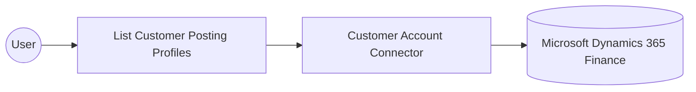

# Example

## What you'll build

This example builds an automation that connects to Microsoft Dynamics 365 Finance and retrieves customer posting profiles, then logs the result. Customer posting profiles determine the ledger accounts used for a customer's financial transactions, making them a foundational reference for accounts receivable processing.

**Operations used:**
- **List Customer Posting Profiles** : Retrieves the collection of customer posting profiles configured in the Microsoft Dynamics 365 Finance environment.

## Architecture

## Prerequisites

- A Microsoft Dynamics 365 Finance and Operations environment, either cloud-hosted or sandbox.
- An Azure Active Directory (Entra ID) app registration with API permissions for Dynamics 365, providing a client ID, a client secret, and a token URL for the OAuth2 client-credentials flow.

- The application must be registered as a user in the target Dynamics 365 Finance and Operations environment and assigned the security roles required for this connector's operations.

## Setting up the Microsoft Dynamics 365 Finance Customer Account integration

> **New to WSO2 Integrator?** Follow the [Create a New Integration](../../../../develop/create-integrations/create-a-new-integration.md) guide to set up your integration first, then return here to add the connector.

## Adding the Microsoft Dynamics 365 Finance Customer Account connector

### Step 1: Open the connector palette

Select **Add Connection** in the **Connections** section.

### Step 2: Select the Microsoft Dynamics 365 Finance Customer Account connector

1. Enter `microsoft.dynamics365.finance.customeraccount` in the search field.
2. Select the **Customeraccount** connector card.

## Configuring the Microsoft Dynamics 365 Finance Customer Account connection

### Step 3: Bind the connection parameters to configurable variables

Bind every required connection field to a configurable variable.

- **Config** : The OAuth2 client-credentials configuration, expressed as the expression `{auth: {tokenUrl, clientId, clientSecret, scopes}}`, bound to the three underlying configurable variables.
- **Service Url** : The URL of the target Microsoft Dynamics 365 Finance and Operations environment, bound to a configurable variable. Use the OData root, for example `https://<your-org>.operations.dynamics.com/data`.

### Step 4: Save the connection

Select **Save Connection** and verify that the connection appears in the **Connections** section.

### Step 5: Set actual values for your configurables

1. Select **Configurations** at the bottom of the project tree under **Data Mappers**.
2. Enter a value for each configurable listed below before you run the integration.

- **tokenUrl** (`string`) : The OAuth2 token endpoint URL for the Azure Active Directory app registration.
- **clientId** (`string`) : The application (client) ID of the Azure Active Directory app registration.
- **clientSecret** (`string`) : The client secret of the Azure Active Directory app registration.
- **scopes** (`string[]`) : The OAuth2 scope requested for the client-credentials token, set to the environment base URL followed by `/.default`
- **serviceUrl** (`string`) : The URL of the target Microsoft Dynamics 365 Finance and Operations environment.

## Configuring the Microsoft Dynamics 365 Finance Customer Account List Customer Posting Profiles operation

### Step 6: Add an automation entry point

1. Select **Add Entry Point** next to **Entry Points**.
2. Select **Automation**.
3. Select **Create** to accept the settings.

### Step 7: Expand the connection and configure the List Customer Posting Profiles operation

1. Select the **+** icon on the automation flow.
2. Expand **customeraccountClient** to display its operations.

3. Select **List Customer Posting Profiles**. This operation has no required parameters.

4. Select **Save**.

### Step 8: Log the List Customer Posting Profiles result

1. Select the **+** icon on the connecting line between the operation and **Error Handler**.
2. Expand **Logging** and select **Log Info**.
3. Switch **Msg** to expression mode and enter `customeraccountCustomerpostingprofilescollection.toJsonString()`.
4. Select **Save**, then return to the visual flow.

## Try it yourself

Try this sample in WSO2 Integration Platform.

[View source on GitHub](https://github.com/wso2/integration-samples/tree/main/integrator-default-profile/connectors/microsoft_dynamics365_finance_customeraccount_connector_sample)

## More code examples

The Dynamics 365 Finance Ballerina connectors provide practical examples illustrating usage in various scenarios.
Explore these [examples](https://github.com/ballerina-platform/module-ballerinax-microsoft.dynamics365.finance/tree/main/examples).
