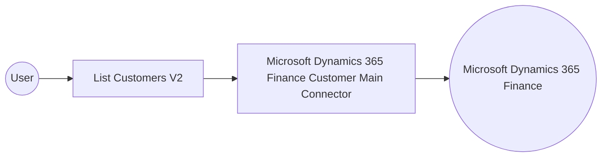

# Example

## What you'll build

This example shows how to connect to Microsoft Dynamics 365 Finance and Operations and retrieve customer records using the Microsoft Dynamics 365 Finance Customer Main connector. The integration authenticates with OAuth 2.0 client credentials, retrieves a collection of customers, and logs the result.

**Operations used:**
- **List Customers V2** : Retrieves a collection of customer records from Microsoft Dynamics 365 Finance and Operations.

## Architecture

## Prerequisites

- A Microsoft Dynamics 365 Finance and Operations environment with an Azure AD application registered for OAuth 2.0 client credentials authentication.
- The application's token URL, client ID, and client secret, along with the service URL of your Dynamics 365 Finance and Operations environment.

- The application must be registered as a user in the target Dynamics 365 Finance and Operations environment and assigned the security roles required for this connector's operations.

## Setting up the Microsoft Dynamics 365 Finance Customer Main integration

> **New to WSO2 Integrator?** Follow the [Create a New Integration](../../../../develop/create-integrations/create-a-new-integration.md) guide to set up your integration first, then return here to add the connector.

## Adding the Microsoft Dynamics 365 Finance Customer Main connector

### Step 1: Open the connector palette

Select **Add Connection** in the **Connections** section.

### Step 2: Select the Microsoft Dynamics 365 Finance Customer Main connector

1. Enter `customermain` in the search field.
2. Select the **Microsoft Dynamics 365 Finance Customer Main** connector card.

## Configuring the Microsoft Dynamics 365 Finance Customer Main connection

### Step 3: Bind the connection parameters to configurable variables

Bind every required connection field to a configurable variable.

- **Config** : The configurations to be used when initializing the connector. Enter the expression `{auth: {tokenUrl, clientId, clientSecret, scopes}}`.
- **Service Url** : The URL of the target Microsoft Dynamics 365 Finance and Operations environment. Use the OData root, for example `https://<your-org>.operations.dynamics.com/data`.

### Step 4: Save the connection

Select **Save** and verify that the connection appears in the **Connections** section.

### Step 5: Set actual values for your configurables

1. Select **Configurations** at the bottom of the project tree under **Data Mappers**.
2. Enter a value for each configurable listed below before you run the integration.

- **tokenUrl** (`string`) : The OAuth 2.0 token endpoint URL for your Azure AD application.
- **clientId** (`string`) : The client ID of your registered Azure AD application.
- **clientSecret** (`string`) : The client secret of your registered Azure AD application.
- **scopes** (`string[]`) : The OAuth2 scope requested for the client-credentials token, set to the environment base URL followed by `/.default`
- **serviceUrl** (`string`) : The URL of your Microsoft Dynamics 365 Finance and Operations environment.

## Configuring the Microsoft Dynamics 365 Finance Customer Main List Customers V2 operation

### Step 6: Add an automation entry point

1. Select **Add Entry Point** next to **Entry Points**.
2. Select **Automation**.
3. Select **Create** to accept the settings.

### Step 7: Expand the connection and configure the List Customers V2 operation

1. Select **Add Step** in the automation flow.
2. Expand **customermainClient** to display its operations.

3. Select **List Customers V2**. This operation has no required parameters.

- **Result** : The name of the result variable, set here to `customermainCustomersv2collection`.

4. Select **Save**.

### Step 8: Log the List Customers V2 result

Select the **+** icon on the flow between the **List Customers V2** step and **Error Handler**, then select **Log Info** under **Logging**.

1. Switch **Msg** to **Expression**.
2. Enter `customermainCustomersv2collection.toJsonString()` in the expression field.
3. Select **Save**.

## Try it yourself

Try this sample in WSO2 Integration Platform.

[View source on GitHub](https://github.com/wso2/integration-samples/tree/main/integrator-default-profile/connectors/microsoft_dynamics365_finance_customermain_connector_sample)

## More code examples

The Dynamics 365 Finance Ballerina connectors provide practical examples illustrating usage in various scenarios.
Explore these [examples](https://github.com/ballerina-platform/module-ballerinax-microsoft.dynamics365.finance/tree/main/examples).
