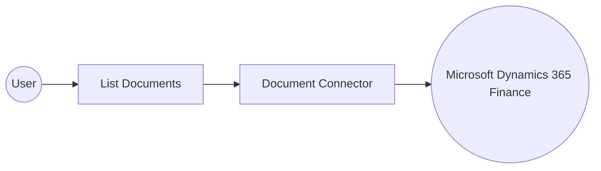

# Example

## What you'll build

This example builds an automation that connects to Microsoft Dynamics 365 Finance and retrieves the available document records. The integration lists documents through the Document connector and logs the result for review.

**Operations used:**
- **List Documents** : Retrieves a collection of document records from the Microsoft Dynamics 365 Finance environment.

## Architecture

## Prerequisites

- A Microsoft Dynamics 365 Finance and Operations environment (cloud-hosted or sandbox).
- An Azure Active Directory (Entra ID) app registration with API permissions for Dynamics 365, including its client ID, client secret, and token URL.

- The application must be registered as a user in the target Dynamics 365 Finance and Operations environment and assigned the security roles required for this connector's operations.

## Setting up the Microsoft Dynamics 365 Finance Document integration

> **New to WSO2 Integrator?** Follow the [Create a New Integration](../../../../develop/create-integrations/create-a-new-integration.md) guide to set up your integration first, then return here to add the connector.

## Adding the Microsoft Dynamics 365 Finance Document connector

### Step 1: Open the connector palette

Select **Add Connection** in the **Connections** section.

### Step 2: Select the Microsoft Dynamics 365 Finance Document connector

1. Enter `microsoft.dynamics365.finance.document` in the search field.
2. Select the **Document** connector card.

## Configuring the Microsoft Dynamics 365 Finance Document connection

### Step 3: Bind the connection parameters to configurable variables

Switch **Config** to expression mode and bind its nested fields to configurable variables. Open the **Service Url** helper panel and create a configurable for it as well.

- **Config** : The authentication settings used when initializing the connector, expressed as `{auth: {tokenUrl, clientId, clientSecret, scopes}}`.
- **Service Url** : URL of the target Microsoft Dynamics 365 Finance and Operations environment. Use the OData root, for example `https://<your-org>.operations.dynamics.com/data`.

### Step 4: Save the connection

Select **Save Connection** and verify that the connection appears in the **Connections** section.

### Step 5: Set actual values for your configurables

1. Select **Configurations** at the bottom of the project tree under **Data Mappers**.
2. Enter a value for each configurable listed below before you run the integration.

- **tokenUrl** (`string`) : The OAuth2 token endpoint URL used to obtain an access token.
- **clientId** (`string`) : The Azure AD application (client) ID used for authentication.
- **clientSecret** (`string`) : The Azure AD application client secret used for authentication.
- **scopes** (`string[]`) : The OAuth2 scope requested for the client-credentials token, set to the environment base URL followed by `/.default`
- **serviceUrl** (`string`) : The URL of the target Microsoft Dynamics 365 Finance and Operations environment.

## Configuring the Microsoft Dynamics 365 Finance Document List Documents operation

### Step 6: Add an automation entry point

1. Select **Add Entry Point** next to **Entry Points**.
2. Select **Automation**.
3. Select **Create** to accept the settings.

### Step 7: Expand the connection and configure the List Documents operation

1. Select the empty node on the automation flow.
2. Expand **documentClient** to display its operations.

3. Select **List Documents**.

This operation has no required parameters. The **Result** field is pre-filled with `documentDocumentscollection` (`document:DocumentsCollection`).

4. Select **Save**.

### Step 8: Log the List Documents result

1. Select the add icon on the connecting line below the **List Documents** node.
2. Select **Log Info** under **Logging**.
3. Switch **Msg** to expression mode and enter `documentDocumentscollection.toJsonString()`.
4. Select **Save**.

## Try it yourself

Try this sample in WSO2 Integration Platform.

[View source on GitHub](https://github.com/wso2/integration-samples/tree/main/integrator-default-profile/connectors/microsoft_dynamics365_finance_document_connector_sample)

## More code examples

The Dynamics 365 Finance Ballerina connectors provide practical examples illustrating usage in various scenarios.
Explore these [examples](https://github.com/ballerina-platform/module-ballerinax-microsoft.dynamics365.finance/tree/main/examples).
