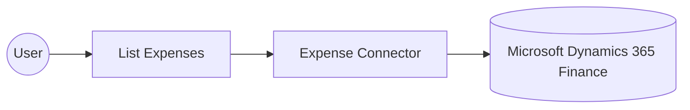

# Example

## What you'll build

This example builds an automation that connects to Microsoft Dynamics 365 Finance and retrieves the organization's expense records. The integration authenticates with OAuth2 client credentials, lists the expense entries through the Expense connector, and logs the result for review.

**Operations used:**
- **List Expenses** : Retrieves the collection of expense records from the connected Microsoft Dynamics 365 Finance and Operations environment.

## Architecture

## Prerequisites

- A Microsoft Dynamics 365 Finance and Operations environment, cloud-hosted or sandbox.
- An Azure Active Directory (Entra ID) application registered with API permissions for Dynamics 365, added as a user in the target environment.
- The application's client ID, client secret, and token URL from the Azure AD app registration.

- The application must be registered as a user in the target Dynamics 365 Finance and Operations environment and assigned the security roles required for this connector's operations.

## Setting up the Microsoft Dynamics 365 Finance Expense integration

> **New to WSO2 Integrator?** Follow the [Create a New Integration](../../../../develop/create-integrations/create-a-new-integration.md) guide to set up your integration first, then return here to add the connector.

## Adding the Microsoft Dynamics 365 Finance Expense connector

### Step 1: Open the connector palette

Select **Add Connection** in the **Connections** section.

### Step 2: Select the Expense connector

1. Enter `microsoft.dynamics365.finance.expense` in the search field.
2. Select the **Expense** connector card.

## Configuring the Microsoft Dynamics 365 Finance Expense connection

### Step 3: Bind the connection parameters to configurable variables

Bind the connection fields to configurable variables.

- **Config** : The connection configuration for the connector, built as an expression that resolves `auth` from the `tokenUrl`, `clientId`, and `clientSecret` configurables. Enter the expression `{auth: {tokenUrl, clientId, clientSecret, scopes}}`.
- **Service Url** : The base URL of the target Microsoft Dynamics 365 Finance and Operations environment, bound to the `serviceUrl` configurable. Use the OData root, for example `https://<your-org>.operations.dynamics.com/data`.

### Step 4: Save the connection

Select **Save Connection** and verify that the connection appears in the **Connections** section.

### Step 5: Set actual values for your configurables

1. Select **Configurations** at the bottom of the project tree under **Data Mappers**.
2. Enter a value for each configurable listed below before you run the integration.

- **tokenUrl** (`string`) : The OAuth2 token endpoint used to obtain an access token from Azure Active Directory.
- **clientId** (`string`) : The application (client) ID of the Azure AD app registration.
- **clientSecret** (`string`) : The client secret generated for the Azure AD app registration.
- **scopes** (`string[]`) : The OAuth2 scope requested for the client-credentials token, set to the environment base URL followed by `/.default`
- **serviceUrl** (`string`) : The base URL of the target Microsoft Dynamics 365 Finance and Operations environment.

## Configuring the Microsoft Dynamics 365 Finance Expense List Expenses operation

### Step 6: Add an automation entry point

1. Select **Add Entry Point** next to **Entry Points**.
2. Select **Automation**.
3. Select **Create** to accept the settings.

### Step 7: Expand the connection and configure the List Expenses operation

1. Select the add icon on the automation flow to open the node panel.
2. Expand **expenseClient** to display its operations.

3. Select **List Expenses**. This operation has no required parameters, so the default **Result** and its `expense:ExpensesCollection` remain unchanged.

4. Select **Save**.

### Step 8: Log the List Expenses result

1. Select the add icon on the connecting line between the **List Expenses** node and **Error Handler**.
2. Expand **Logging** and select **Log Info**.
3. Switch **Msg** to expression mode and enter `expenseExpensescollection.toJsonString()`.
4. Select **Save**.

Return to the visual flow and confirm the complete chain from **Start** through **List Expenses** and the log action to **Error Handler**, with no problems reported.

## Try it yourself

Try this sample in WSO2 Integration Platform.

[View source on GitHub](https://github.com/wso2/integration-samples/tree/main/integrator-default-profile/connectors/microsoft_dynamics365_finance_expense_connector_sample)

## More code examples

The Dynamics 365 Finance Ballerina connectors provide practical examples illustrating usage in various scenarios.
Explore these [examples](https://github.com/ballerina-platform/module-ballerinax-microsoft.dynamics365.finance/tree/main/examples).
