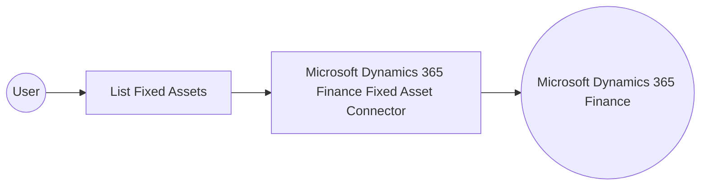

# Example

## What you'll build

This example builds an automation that connects to Microsoft Dynamics 365 Finance and retrieves the fixed assets configured for a Finance and Operations environment. The automation logs the retrieved collection so you can confirm the connection and operation work end to end.

**Operations used:**
- **List Fixed Assets** : Retrieves the collection of fixed asset master records defined in the target Dynamics 365 Finance and Operations environment.

## Architecture

## Prerequisites

- A Microsoft Dynamics 365 Finance and Operations environment, cloud-hosted or sandbox, with an OAuth2 client credentials application configured for API access.
- An Azure Active Directory application registration with API permissions granted and consented for Dynamics 365 Finance and Operations.

- The application must be registered as a user in the target Dynamics 365 Finance and Operations environment and assigned the security roles required for this connector's operations.

## Setting up the Microsoft Dynamics 365 Finance Fixed Asset integration

> **New to WSO2 Integrator?** Follow the [Create a New Integration](../../../../develop/create-integrations/create-a-new-integration.md) guide to set up your integration first, then return here to add the connector.

## Adding the Microsoft Dynamics 365 Finance Fixed Asset connector

### Step 1: Open the connector palette

Select **Add Connection** in the **Connections** section.

### Step 2: Select the Microsoft Dynamics 365 Finance Fixed Asset connector

1. Enter `microsoft.dynamics365.finance.fixedasset` in the search field.
2. Select the **Fixedasset** connector card.

## Configuring the Microsoft Dynamics 365 Finance Fixed Asset connection

### Step 3: Bind the connection parameters to configurable variables

Bind every connection field to a configurable variable rather than a literal value.

- **Config** : An expression that references configurable variables for the OAuth2 client credentials settings — token URL, client ID, and client secret. Enter the expression `{auth: {tokenUrl, clientId, clientSecret, scopes}}`.
- **Service Url** : A reference to a configurable variable holding the target Dynamics 365 Finance and Operations environment URL. Use the OData root, for example `https://<your-org>.operations.dynamics.com/data`.

### Step 4: Save the connection

Select **Save Connection** and verify that the connection appears in the **Connections** section.

### Step 5: Set actual values for your configurables

1. Select **Configurations** at the bottom of the project tree under **Data Mappers**.
2. Enter a value for each configurable listed below before you run the integration.

- **tokenUrl** (`string`) : The OAuth2 token endpoint used to obtain an access token for the target environment.
- **clientId** (`string`) : The application (client) identifier from the Azure Active Directory registration.
- **clientSecret** (`string`) : The client secret value from the Azure Active Directory registration.
- **scopes** (`string[]`) : The OAuth2 scope requested for the client-credentials token, set to the environment base URL followed by `/.default`
- **serviceUrl** (`string`) : The base URL of the target Dynamics 365 Finance and Operations environment.

## Configuring the Microsoft Dynamics 365 Finance Fixed Asset List Fixed Assets operation

### Step 6: Add an automation entry point

1. Select **Add Entry Point** next to **Entry Points**.
2. Select **Automation**.
3. Select **Create** to accept the settings.

### Step 7: Expand the connection and configure the List Fixed Assets operation

1. Select the add icon on the automation flow between **Start** and **Error Handler**.
2. Expand **fixedassetClient** to display its operations.

3. Select **List Fixed Assets**. This operation has no required fields, so the default result variable is used as is.

4. Select **Save**.

### Step 8: Log the List Fixed Assets result

Add a **Log Info** action on the connecting line after the operation, switch its message to expression mode, and reference the result variable's `toJsonString()` value, then return to the visual flow.

## Try it yourself

Try this sample in WSO2 Integration Platform.

[View source on GitHub](https://github.com/wso2/integration-samples/tree/main/integrator-default-profile/connectors/microsoft_dynamics365_finance_fixedasset_connector_sample)

## More code examples

The Dynamics 365 Finance Ballerina connectors provide practical examples illustrating usage in various scenarios.
Explore these [examples](https://github.com/ballerina-platform/module-ballerinax-microsoft.dynamics365.finance/tree/main/examples).
