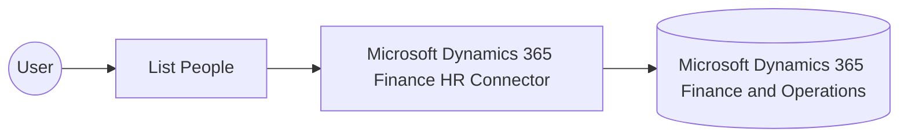

# Example

## What you'll build

This example builds an automation that connects to Microsoft Dynamics 365 Finance HR and retrieves person master data. The automation authenticates with OAuth2 client credentials, runs the operation, and logs the returned collection for verification.

**Operations used:**
- **List People** : Retrieves the collection of person master data records from Microsoft Dynamics 365 Finance and Operations.

## Architecture

## Prerequisites

- A Microsoft Dynamics 365 Finance and Operations environment.
- An Azure Active Directory (Entra ID) app registration configured for client credentials, added as a user with appropriate security roles in the target environment.

## Setting up the Microsoft Dynamics 365 Finance HR integration

> **New to WSO2 Integrator?** Follow the [Create a New Integration](../../../../develop/create-integrations/create-a-new-integration.md) guide to set up your integration first, then return here to add the connector.

## Adding the Microsoft Dynamics 365 Finance HR connector

### Step 1: Open the connector palette

Select **Add Connection** in the **Connections** section.

### Step 2: Select the Microsoft Dynamics 365 Finance HR connector

1. Enter `microsoft.dynamics365.finance.hr` in the search field.
2. Select the **Hr** connector card.

## Configuring the Microsoft Dynamics 365 Finance HR connection

### Step 3: Bind the connection parameters to configurable variables

Bind every required connection field to a configurable variable.

- **Config** : Switch to an expression that references the `tokenUrl`, `clientId`, `clientSecret`, and `scopes` configurables nested under `auth`. Enter the expression `{auth: {tokenUrl, clientId, clientSecret, scopes}}`.
- **Service Url** : Bind to the `serviceUrl` configurable through the field's helper panel.

### Step 4: Save the connection

Select **Save Connection** and verify that the connection appears in the **Connections** section.

### Step 5: Set actual values for your configurables

1. Select **Configurations** at the bottom of the project tree under **Data Mappers**.
2. Enter a value for each configurable listed below before you run the integration.

- **tokenUrl** (`string`) : The OAuth2 token endpoint URL for the Azure AD application, for example `https://login.microsoftonline.com/<tenant-id>/oauth2/v2.0/token`.
- **clientId** (`string`) : The application (client) identifier of the Azure AD app registration.
- **clientSecret** (`string`) : The client secret of the Azure AD app registration.
- **scopes** (`string[]`) : The OAuth2 scope requested for the client-credentials token, set to the environment base URL followed by `/.default`
- **serviceUrl** (`string`) : The URL of the target Microsoft Dynamics 365 Finance and Operations environment, for example `https://<your-org>.operations.dynamics.com/data`.

## Configuring the Microsoft Dynamics 365 Finance HR List People operation

### Step 6: Add an automation entry point

1. Select **Add Entry Point** next to **Entry Points**.
2. Select **Automation**.
3. Select **Create** to accept the settings.

### Step 7: Expand the connection and configure the List People operation

1. Select **Add Step** in the automation flow.
2. Expand **hrClient** to display its operations.

3. Select **List People**. This operation has no required parameters, and the generated result is named `hrPeoplecollection` (`hr:PeopleCollection`).

4. Select **Save**.

### Step 8: Log the List People result

Add a **Log Info** action, switch its **Msg** field to expression mode, and enter `hrPeoplecollection.toJsonString()` to log the result. Return to the visual flow to confirm the complete chain.

## Try it yourself

Try this sample in WSO2 Integration Platform.

[View source on GitHub](https://github.com/wso2/integration-samples/tree/main/integrator-default-profile/connectors/microsoft_dynamics365_finance_hr_connector_sample)

## More code examples

The Dynamics 365 Finance Ballerina connectors provide practical examples illustrating usage in various scenarios.
Explore these [examples](https://github.com/ballerina-platform/module-ballerinax-microsoft.dynamics365.finance/tree/main/examples).
