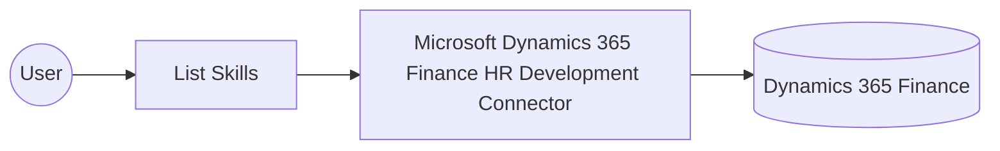

# Example

## What you'll build

This example builds an integration that connects to Microsoft Dynamics 365 Finance HR Development and retrieves the collection of skills defined in the environment. The integration logs the retrieved skills collection as a JSON string so you can confirm the operation ran successfully.

**Operations used:**
- **List Skills** : Retrieves the collection of skills configured in Microsoft Dynamics 365 Finance HR Development.

## Architecture

## Prerequisites

- A Microsoft Dynamics 365 Finance and Operations environment with an Azure Active Directory app registration that has API permissions for Dynamics 365.

- The application must be registered as a user in the target Dynamics 365 Finance and Operations environment and assigned the security roles required for this connector's operations.

## Setting up the Microsoft Dynamics 365 Finance HR Development integration

> **New to WSO2 Integrator?** Follow the [Create a New Integration](../../../../develop/create-integrations/create-a-new-integration.md) guide to set up your integration first, then return here to add the connector.

## Adding the Microsoft Dynamics 365 Finance HR Development connector

### Step 1: Open the connector palette

Select **Add Connection** in the **Connections** section.

### Step 2: Select the Microsoft Dynamics 365 Finance HR Development connector

1. Enter `microsoft.dynamics365.finance.hrdev` in the search field.
2. Select the **Microsoft Dynamics 365 Finance HR Development** connector card.

## Configuring the Microsoft Dynamics 365 Finance HR Development connection

### Step 3: Bind the connection parameters to configurable variables

Bind every required connection field to a configurable variable.

- **Config** : Switch to an expression that references the `tokenUrl`, `clientId`, `clientSecret`, and `scopes` configurables nested under `auth`. Enter the expression `{auth: {tokenUrl, clientId, clientSecret, scopes}}`.
- **Service Url** : The base URL of the Dynamics 365 Finance environment. Use the OData root, for example `https://<your-org>.operations.dynamics.com/data`.

### Step 4: Save the connection

Select **Save** and verify that the connection appears in the **Connections** section.

### Step 5: Set actual values for your configurables

1. Select **Configurations** at the bottom of the project tree under **Data Mappers**.
2. Enter a value for each configurable listed below before you run the integration.

- **tokenUrl** (`string`) : The OAuth2 token endpoint used to obtain an access token.
- **clientId** (`string`) : The application (client) ID of the Azure AD app registration.
- **clientSecret** (`string`) : The client secret generated for the Azure AD app registration.
- **scopes** (`string[]`) : The OAuth2 scope requested for the client-credentials token, set to the environment base URL followed by `/.default`
- **serviceUrl** (`string`) : The base URL of the Dynamics 365 Finance environment.

## Configuring the Microsoft Dynamics 365 Finance HR Development List Skills operation

### Step 6: Add an automation entry point

1. Select **Add Entry Point** next to **Entry Points**.
2. Select **Automation**.
3. Select **Create** to accept the settings.

### Step 7: Expand the connection and configure the List Skills operation

1. Select **Add Step** in the automation flow.
2. Expand **hrdevClient** to display its operations.

3. Select **List Skills** to retrieve the skills collection; this operation requires no additional parameters.

4. Select **Save**.

### Step 8: Log the List Skills result

Add a **Log Info** action, switch its **Msg** field to expression mode, and enter `hrdevSkillscollection.toJsonString()` to log the result. Return to the visual flow to confirm the complete chain.

## Try it yourself

Try this sample in WSO2 Integration Platform.

[View source on GitHub](https://github.com/wso2/integration-samples/tree/main/integrator-default-profile/connectors/microsoft_dynamics365_finance_hrdev_connector_sample)

## More code examples

The Dynamics 365 Finance Ballerina connectors provide practical examples illustrating usage in various scenarios.
Explore these [examples](https://github.com/ballerina-platform/module-ballerinax-microsoft.dynamics365.finance/tree/main/examples).
