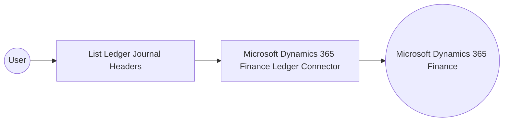

# Example

## What you'll build

This example builds an automation that connects to Microsoft Dynamics 365 Finance and retrieves general ledger journal header records through the Microsoft Dynamics 365 Finance Ledger connector. The integration authenticates with an OAuth2 client credentials grant, retrieves the ledger journal header collection, and logs the result as JSON.

**Operations used:**
- **List Ledger Journal Headers** : Retrieves the collection of general ledger journal header records recorded in Microsoft Dynamics 365 Finance.

## Architecture

## Prerequisites

- A Microsoft Dynamics 365 Finance and Operations environment, either cloud-hosted or sandbox.
- An Azure Active Directory (Entra ID) app registration with API permissions for Dynamics 365, providing a client identifier, a client secret, and a token endpoint.

- The application must be registered as a user in the target Dynamics 365 Finance and Operations environment and assigned the security roles required for this connector's operations.

## Setting up the Microsoft Dynamics 365 Finance Ledger integration

> **New to WSO2 Integrator?** Follow the [Create a New Integration](../../../../develop/create-integrations/create-a-new-integration.md) guide to set up your integration first, then return here to add the connector.

## Adding the Microsoft Dynamics 365 Finance Ledger connector

### Step 1: Open the connector palette

Select **Add Connection** in the **Connections** section.

### Step 2: Select the Microsoft Dynamics 365 Finance Ledger connector

1. Enter `microsoft.dynamics365.finance.ledger` in the search field.
2. Select the **Ledger** connector card.

## Configuring the Microsoft Dynamics 365 Finance Ledger connection

### Step 3: Bind the connection parameters to configurable variables

Bind every connection field to a configurable variable rather than entering a literal value.

- **Config** : The connection settings record, including the OAuth2 client credentials grant used to authenticate with Microsoft Dynamics 365 Finance. Enter the expression `{auth: {tokenUrl, clientId, clientSecret, scopes}}`.
- **Service Url** : The base address of the target Microsoft Dynamics 365 Finance and Operations environment. Use the OData root, for example `https://<your-org>.operations.dynamics.com/data`.

### Step 4: Save the connection

Select **Save Connection** and verify that the connection appears in the **Connections** section.

### Step 5: Set actual values for your configurables

1. Select **Configurations** at the bottom of the project tree under **Data Mappers**.
2. Enter a value for each configurable listed below before you run the integration.

- **tokenUrl** (`string`) : The OAuth2 token endpoint used to obtain an access token for Microsoft Dynamics 365 Finance.
- **clientId** (`string`) : The application (client) identifier from the Azure Active Directory app registration.
- **clientSecret** (`string`) : The client secret generated for the Azure Active Directory app registration.
- **scopes** (`string[]`) : The OAuth2 scope requested for the client-credentials token, set to the environment base URL followed by `/.default`
- **serviceUrl** (`string`) : The base address of the target Microsoft Dynamics 365 Finance and Operations environment.

## Configuring the Microsoft Dynamics 365 Finance Ledger List Ledger Journal Headers operation

### Step 6: Add an automation entry point

1. Select **Add Entry Point** next to **Entry Points**.
2. Select **Automation**.
3. Select **Create** to accept the settings.

### Step 7: Expand the connection and configure the List Ledger Journal Headers operation

1. Select the **+** icon on the automation flow to add a step.
2. Expand **ledgerClient** to display its operations.

3. Select **List Ledger Journal Headers**. This operation has no required values beyond the generated result variable.

- **Result** : Name of the variable that stores the returned collection of ledger journal headers.

4. Select **Save**.

### Step 8: Log the List Ledger Journal Headers result

Add a **Log Info** action, switch its **Msg** field to expression mode, and enter `ledgerLedgerjournalheaderscollection.toJsonString()` to log the result. Return to the visual flow to review the complete chain.

## Try it yourself

Try this sample in WSO2 Integration Platform.

[View source on GitHub](https://github.com/wso2/integration-samples/tree/main/integrator-default-profile/connectors/microsoft_dynamics365_finance_ledger_connector_sample)

## More code examples

The Dynamics 365 Finance Ballerina connectors provide practical examples illustrating usage in various scenarios.
Explore these [examples](https://github.com/ballerina-platform/module-ballerinax-microsoft.dynamics365.finance/tree/main/examples).
