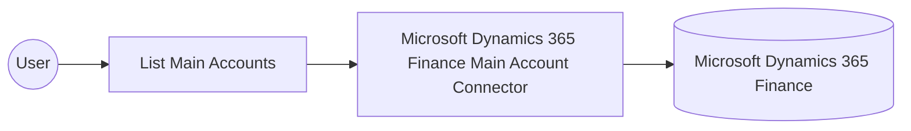

# Example

## What you'll build

This example builds an integration that connects to Microsoft Dynamics 365 Finance and retrieves the chart of accounts main account entities through the Microsoft Dynamics 365 Finance Main Account connector. The integration authenticates with the OAuth2 client credentials grant, lists the main accounts configured in the target environment, and logs the result for verification.

**Operations used:**
- **List Main Accounts** : Retrieves the collection of main account entities configured in the target Microsoft Dynamics 365 Finance environment.

## Architecture

## Prerequisites

- A Microsoft Dynamics 365 Finance and Operations environment (cloud-hosted or sandbox) with a chart of accounts configured.
- An Azure Active Directory (Entra ID) application registration with API permissions for Microsoft Dynamics 365 and a generated client secret.

- The application must be registered as a user in the target Dynamics 365 Finance and Operations environment and assigned the security roles required for this connector's operations.

## Setting up the Microsoft Dynamics 365 Finance Main Account integration

> **New to WSO2 Integrator?** Follow the [Create a New Integration](../../../../develop/create-integrations/create-a-new-integration.md) guide to set up your integration first, then return here to add the connector.

## Adding the Microsoft Dynamics 365 Finance Main Account connector

### Step 1: Open the connector palette

Select **Add Connection** in the **Connections** section.

### Step 2: Select the Microsoft Dynamics 365 Finance Main Account connector

1. Enter `microsoft.dynamics365.finance.mainaccount` in the search field.
2. Select the **Microsoft Dynamics 365 Finance Main Account** connector card.

## Configuring the Microsoft Dynamics 365 Finance Main Account connection

### Step 3: Bind the connection parameters to configurable variables

Bind every connection field to a configurable variable.

- **Config** : Binds the OAuth2 client credentials settings to the `tokenUrl`, `clientId`, and `clientSecret` configurable variables through an expression. Enter the expression `{auth: {tokenUrl, clientId, clientSecret, scopes}}`.
- **Service Url** : Binds the target environment endpoint to the `serviceUrl` configurable variable. Use the OData root, for example `https://<your-org>.operations.dynamics.com/data`.

### Step 4: Save the connection

Select **Save** and verify that the connection appears in the **Connections** section.

### Step 5: Set actual values for your configurables

1. Select **Configurations** at the bottom of the project tree under **Data Mappers**.
2. Enter a value for each configurable listed below before you run the integration.

- **tokenUrl** (`string`) : The OAuth2 token endpoint used to exchange the client credentials for an access token.
- **clientId** (`string`) : The Azure Active Directory application (client) ID for the registered app.
- **clientSecret** (`string`) : The client secret generated for the registered Azure Active Directory application.
- **scopes** (`string[]`) : The OAuth2 scope requested for the client-credentials token, set to the environment base URL followed by `/.default`
- **serviceUrl** (`string`) : The base URL of the target Microsoft Dynamics 365 Finance and Operations environment.

## Configuring the Microsoft Dynamics 365 Finance Main Account List Main Accounts operation

### Step 6: Add an automation entry point

1. Select **Add Entry Point** next to **Entry Points**.
2. Select **Automation**.
3. Select **Create** to accept the settings.

### Step 7: Expand the connection and select the List Main Accounts operation

1. Select the add icon on the automation flow between **Start** and **Error Handler**.
2. Expand **mainaccountClient** under **Connections** to display its operations.

3. Select **List Main Accounts**.

- **Result** : The variable that stores the returned main accounts collection (`mainaccount:MainAccountsCollection`).

4. Select **Save**.

### Step 8: Log the List Main Accounts result

Add a **Log Info** action, switch its **Msg** field to expression mode, and enter `mainaccountMainaccountscollection.toJsonString()` to log the result, then return to the visual flow.

## Try it yourself

Try this sample in WSO2 Integration Platform.

[View source on GitHub](https://github.com/wso2/integration-samples/tree/main/integrator-default-profile/connectors/microsoft_dynamics365_finance_mainaccount_connector_sample)

## More code examples

The Dynamics 365 Finance Ballerina connectors provide practical examples illustrating usage in various scenarios.
Explore these [examples](https://github.com/ballerina-platform/module-ballerinax-microsoft.dynamics365.finance/tree/main/examples).
