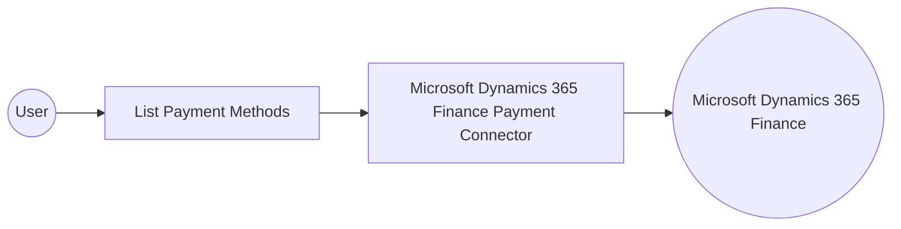

# Example

## What you'll build

This example builds an automation that connects to Microsoft Dynamics 365 Finance Payment and retrieves the configured payment methods. The integration logs the returned collection so you can confirm the connection and operation work end to end.

**Operations used:**
- **List Payment Methods** : Retrieves the collection of payment methods configured in the Microsoft Dynamics 365 Finance environment.

## Architecture

## Prerequisites

- A Microsoft Dynamics 365 Finance and Operations environment (cloud-hosted or sandbox).
- An Azure Active Directory (Entra ID) app registration with API permissions for Dynamics 365, which provides a client ID, a client secret, and a token URL.

- The application must be registered as a user in the target Dynamics 365 Finance and Operations environment and assigned the security roles required for this connector's operations.

## Setting up the Microsoft Dynamics 365 Finance Payment integration

> **New to WSO2 Integrator?** Follow the [Create a New Integration](../../../../develop/create-integrations/create-a-new-integration.md) guide to set up your integration first, then return here to add the connector.

## Adding the Microsoft Dynamics 365 Finance Payment connector

### Step 1: Open the connector palette

Select **Add Connection** in the **Connections** section.

### Step 2: Select the Microsoft Dynamics 365 Finance Payment connector

1. Enter `microsoft.dynamics365.finance.payment` in the search field.
2. Select the **Payment** connector card.

## Configuring the Microsoft Dynamics 365 Finance Payment connection

### Step 3: Bind the connection parameters to configurable variables

Bind every connection field to a configurable variable.

- **Config** : An expression that references the `auth` sub-fields — `tokenUrl`, `clientId`, and `clientSecret` — as configurable variables. Enter the expression `{auth: {tokenUrl, clientId, clientSecret, scopes}}`.
- **Service Url** : The base URL of the target Microsoft Dynamics 365 Finance and Operations environment, bound to the `serviceUrl` configurable variable. Use the OData root, for example `https://<your-org>.operations.dynamics.com/data`.

### Step 4: Save the connection

Select **Save** and verify that the connection appears in the **Connections** section.

### Step 5: Set actual values for your configurables

1. Select **Configurations** at the bottom of the project tree under **Data Mappers**.
2. Enter a value for each configurable listed below before you run the integration.

- **tokenUrl** (`string`) : The OAuth2 token endpoint used to obtain an access token for the client credentials grant.
- **clientId** (`string`) : The Azure Active Directory application (client) ID.
- **clientSecret** (`string`) : The Azure Active Directory application client secret.
- **scopes** (`string[]`) : The OAuth2 scope requested for the client-credentials token, set to the environment base URL followed by `/.default`
- **serviceUrl** (`string`) : The base URL of the target Microsoft Dynamics 365 Finance and Operations environment.

## Configuring the Microsoft Dynamics 365 Finance Payment List Payment Methods operation

### Step 6: Add an automation entry point

1. Select **Add Entry Point** next to **Entry Points**.
2. Select **Automation**.
3. Select **Create** to accept the settings.

### Step 7: Expand the connection and configure the List Payment Methods operation

1. Select **Add Step** in the automation flow.
2. Expand **paymentClient** to display its operations.

3. Select **List Payment Methods**. This operation has no required parameters.

4. Select **Save**.

### Step 8: Log the List Payment Methods result

Add a **Log Info** action, switch its **Msg** field to expression mode, and enter `paymentPaymentmethodscollection.toJsonString()` to log the result, then return to the visual flow.

## Try it yourself

Try this sample in WSO2 Integration Platform.

[View source on GitHub](https://github.com/wso2/integration-samples/tree/main/integrator-default-profile/connectors/microsoft_dynamics365_finance_payment_connector_sample)

## More code examples

The Dynamics 365 Finance Ballerina connectors provide practical examples illustrating usage in various scenarios.
Explore these [examples](https://github.com/ballerina-platform/module-ballerinax-microsoft.dynamics365.finance/tree/main/examples).
