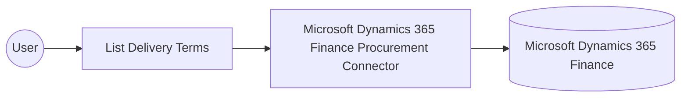

# Example

## What you'll build

This example builds an automation that connects to Microsoft Dynamics 365 Finance Procurement and retrieves the delivery terms configured in the environment. The integration authenticates with OAuth2 client credentials, runs the operation, and logs the returned collection.

**Operations used:**
- **List Delivery Terms** : Retrieves the collection of delivery terms configured in Microsoft Dynamics 365 Finance.

## Architecture

## Prerequisites

- A Microsoft Dynamics 365 Finance and Operations environment, cloud-hosted or sandbox.
- An Azure Active Directory (Entra ID) app registration with API permissions granted for Dynamics 365, including its client ID, client secret, and token URL.

- The application must be registered as a user in the target Dynamics 365 Finance and Operations environment and assigned the security roles required for this connector's operations.

## Setting up the Microsoft Dynamics 365 Finance Procurement integration

> **New to WSO2 Integrator?** Follow the [Create a New Integration](../../../../develop/create-integrations/create-a-new-integration.md) guide to set up your integration first, then return here to add the connector.

## Adding the Microsoft Dynamics 365 Finance Procurement connector

### Step 1: Open the connector palette

Select **Add Connection** in the **Connections** section.

### Step 2: Select the Microsoft Dynamics 365 Finance Procurement connector

1. Enter `microsoft.dynamics365.finance.procurement` in the search field.
2. Select the **Procurement** connector card.

## Configuring the Microsoft Dynamics 365 Finance Procurement connection

### Step 3: Bind the connection parameters to configurable variables

Configure the authentication and endpoint fields so the connection form stores no secrets directly.

1. Select **auth** within **Config** to reveal its fields, then enable the optional **tokenUrl** field alongside the required **clientId** and **clientSecret** fields.
2. Switch **Config** to **Expression** mode and enter the record `{auth: {tokenUrl, clientId, clientSecret, scopes}}`.
3. Open the helper panel for **Service Url**, select the **Configurables** tab, and create a new configurable named `serviceUrl`.

- **Config** : The OAuth2 client credentials settings used to authenticate with Microsoft Dynamics 365 Finance.
- **Service Url** : The base URL of the Microsoft Dynamics 365 Finance and Operations environment.

### Step 4: Save the connection

Select **Save Connection** and verify that **procurementClient** appears in the **Connections** section.

### Step 5: Set actual values for your configurables

1. Select **Configurations** at the bottom of the project tree under **Data Mappers**.
2. Enter a value for each configurable listed below before you run the integration.

- **tokenUrl** (`string`) : The OAuth2 token endpoint URL for the Azure AD tenant that issues access tokens.
- **clientId** (`string`) : The application (client) ID of the Azure AD app registration.
- **clientSecret** (`string`) : The client secret generated for the Azure AD app registration.
- **scopes** (`string[]`) : The OAuth2 scope requested for the client-credentials token, set to the environment base URL followed by `/.default`
- **serviceUrl** (`string`) : The base URL of the Microsoft Dynamics 365 Finance and Operations environment, such as `https://<your-org>.operations.dynamics.com/data`.

## Configuring the Microsoft Dynamics 365 Finance Procurement List Delivery Terms operation

### Step 6: Add an automation entry point

1. Select **Add Entry Point** next to **Entry Points**.
2. Select **Automation**.
3. Select **Create** to accept the settings.

### Step 7: Expand the connection and configure the List Delivery Terms operation

1. Select the add icon on the automation flow to open the node panel.
2. Expand **procurementClient** to display its operations.

3. Select **List Delivery Terms**. This operation has no required parameters, so review the default result variable.

- **Result** : The variable that holds the returned collection of delivery terms.

4. Select **Save**.

### Step 8: Log the List Delivery Terms result

1. Select the add icon on the connecting line between the operation and **Error Handler**.
2. Expand **Logging** and select **Log Info**.
3. Switch **Msg** to **Expression** mode and enter `procurementDeliverytermscollection.toJsonString()`.
4. Select **Save**.

## Try it yourself

Try this sample in WSO2 Integration Platform.

[View source on GitHub](https://github.com/wso2/integration-samples/tree/main/integrator-default-profile/connectors/microsoft_dynamics365_finance_procurement_connector_sample)

## More code examples

The Dynamics 365 Finance Ballerina connectors provide practical examples illustrating usage in various scenarios.
Explore these [examples](https://github.com/ballerina-platform/module-ballerinax-microsoft.dynamics365.finance/tree/main/examples).
