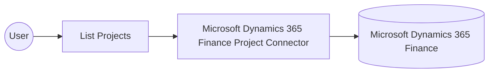

# Example

## What you'll build

This example builds an automation that connects to Microsoft Dynamics 365 Finance and retrieves the collection of project records defined in the environment. The integration lists all projects and logs the result so you can verify the connection end to end.

**Operations used:**
- **List Projects** : Retrieves the collection of project records from Microsoft Dynamics 365 Finance.

## Architecture

## Prerequisites

- A Microsoft Dynamics 365 Finance environment, either cloud-hosted or a sandbox.
- An Azure Active Directory app registration with API permissions granted for Dynamics 365, along with its client ID, client secret, and OAuth2 token URL.

- The application must be registered as a user in the target Dynamics 365 Finance and Operations environment and assigned the security roles required for this connector's operations.

## Setting up the Microsoft Dynamics 365 Finance Project integration

> **New to WSO2 Integrator?** Follow the [Create a New Integration](../../../../develop/create-integrations/create-a-new-integration.md) guide to set up your integration first, then return here to add the connector.

## Adding the Microsoft Dynamics 365 Finance Project connector

### Step 1: Open the connector palette

Select **Add Connection** in the **Connections** section.

### Step 2: Select the Microsoft Dynamics 365 Finance Project connector

1. Enter `microsoft.dynamics365.finance.project` in the search field.
2. Select the **Microsoft Dynamics 365 Finance Project** connector card.

## Configuring the Microsoft Dynamics 365 Finance Project connection

### Step 3: Bind the connection parameters to configurable variables

Bind every required connection field to a configurable variable.

- **Config** : The authentication record for the connection, referencing configurable variables for the token URL, client ID, and client secret. Enter the expression `{auth: {tokenUrl, clientId, clientSecret, scopes}}`.
- **Service Url** : The base URL of the target Microsoft Dynamics 365 Finance and Operations environment. Use the OData root, for example `https://<your-org>.operations.dynamics.com/data`.

### Step 4: Save the connection

Select **Save Connection** and verify that the connection appears in the **Connections** section.

### Step 5: Set actual values for your configurables

1. Select **Configurations** at the bottom of the project tree under **Data Mappers**.
2. Enter a value for each configurable listed below before you run the integration.

- **tokenUrl** (`string`) : The OAuth2 token endpoint used to obtain an access token for the Azure Active Directory app registration.
- **clientId** (`string`) : The application (client) identifier from the Azure Active Directory app registration.
- **clientSecret** (`string`) : The client secret generated for the Azure Active Directory app registration.
- **scopes** (`string[]`) : The OAuth2 scope requested for the client-credentials token, set to the environment base URL followed by `/.default`
- **serviceUrl** (`string`) : The base URL of the target Microsoft Dynamics 365 Finance and Operations environment.

## Configuring the Microsoft Dynamics 365 Finance Project List Projects operation

### Step 6: Add an automation entry point

1. Select **Add Entry Point** next to **Entry Points**.
2. Select **Automation**.
3. Select **Create** to accept the settings.

### Step 7: Expand the connection and configure the List Projects operation

1. Select the add-node control between **Start** and **Error Handler** on the automation flow.
2. Expand **projectClient** to display its operations.

3. Select **List Projects**. This operation has no required parameters, so the default result variable is ready to use.

4. Select **Save**.

### Step 8: Log the List Projects result

Add a **Log Info** action, switch its **Msg** field to expression mode, and enter `projectProjectscollection.toJsonString()` to log the result, then return to the visual flow.

## Try it yourself

Try this sample in WSO2 Integration Platform.

[View source on GitHub](https://github.com/wso2/integration-samples/tree/main/integrator-default-profile/connectors/microsoft_dynamics365_finance_project_connector_sample)

## More code examples

The Dynamics 365 Finance Ballerina connectors provide practical examples illustrating usage in various scenarios.
Explore these [examples](https://github.com/ballerina-platform/module-ballerinax-microsoft.dynamics365.finance/tree/main/examples).
