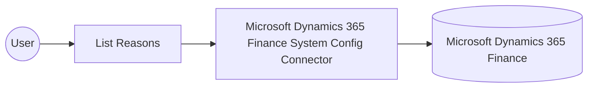

# Example

## What you'll build

This example builds an automation that connects to Microsoft Dynamics 365 Finance System Config and lists the reason codes configured in the environment. The flow authenticates with Microsoft Entra ID using the OAuth2 client credentials grant, retrieves the reason records, and logs the result as JSON.

**Operations used:**
- **List Reasons** : Reads all `Reasons` records — the general-purpose reason codes used for write-offs, adjustments, and other transactions — from the connected environment.

## Architecture

## Prerequisites

- A Microsoft Entra ID application registered with access to a Microsoft Dynamics 365 Finance and Operations environment, along with its client ID, client secret, and OAuth2 token URL.

- The application must be registered as a user in the target Dynamics 365 Finance and Operations environment and assigned the security roles required for this connector's operations.

## Setting up the Microsoft Dynamics 365 Finance System Config integration

> **New to WSO2 Integrator?** Follow the [Create a New Integration](../../../../develop/create-integrations/create-a-new-integration.md) guide to set up your integration first, then return here to add the connector.

## Adding the Microsoft Dynamics 365 Finance System Config connector

### Step 1: Open the connector palette

Select **Add Connection** in the **Connections** section.

### Step 2: Select the Microsoft Dynamics 365 Finance System Config connector

1. Enter `microsoft.dynamics365.finance.sysconfig` in the search field.
2. Select the **Sysconfig** connector card.

## Configuring the Microsoft Dynamics 365 Finance System Config connection

### Step 3: Bind the connection parameters to configurable variables

1. Select the **Config** field to open the **Record Configuration** panel.
2. Select the **auth** checkbox to include the OAuth2 client credentials fields; the required `clientId` and `clientSecret` fields are included automatically.
3. Select the optional **tokenUrl** field as well, since the client credentials grant needs it.
4. Close the **Record Configuration** panel, then create three string configurable variables named `tokenUrl`, `clientId`, and `clientSecret` under **Configurations**.
5. Return to **Add Connection**, search for the connector again, and switch the **Config** field from **Record** to **Expression** mode.
6. Enter `{auth: {tokenUrl, clientId, clientSecret, scopes}}` as the expression, referencing the three configurable variables.
7. Open the helper panel for the **Service Url** field, select the **Configurables** tab, and create a string configurable named `serviceUrl`; it's inserted into the field automatically.

- **Config** : The OAuth2 client credentials configuration used to authenticate the connection.
- **Service Url** : URL of the target Microsoft Dynamics 365 Finance and Operations environment. Use the OData root, for example `https://<your-org>.operations.dynamics.com/data`.

### Step 4: Save the connection

Select **Save Connection** and verify that `sysconfigClient` appears in the **Connections** section.

### Step 5: Set actual values for your configurables

1. Select **Configurations** at the bottom of the project tree under **Data Mappers**.
2. Enter a value for each configurable listed below before you run the integration.

- **tokenUrl** (`string`) : The OAuth2 token endpoint URL for the Microsoft Entra ID application.
- **clientId** (`string`) : The client ID of the registered Microsoft Entra ID application.
- **clientSecret** (`string`) : The client secret of the registered Microsoft Entra ID application.
- **scopes** (`string[]`) : The OAuth2 scope requested for the client-credentials token, set to the environment base URL followed by `/.default`
- **serviceUrl** (`string`) : URL of the target Microsoft Dynamics 365 Finance and Operations environment.

## Configuring the Microsoft Dynamics 365 Finance System Config List Reasons operation

### Step 6: Add an automation entry point

1. Select **Add Entry Point** next to **Entry Points**.
2. Select **Automation**.
3. Select **Create** to accept the settings.

### Step 7: Expand the connection and configure the List Reasons operation

1. Select the add icon on the automation flow.
2. Expand **sysconfigClient** to display its operations.

3. Select **List Reasons**. This operation has no required parameters, so the default result variable name, `sysconfigReasonscollection`, is sufficient.

4. Select **Save**.

### Step 8: Log the List Reasons result

1. Select the add icon on the link between the **List Reasons** node and **Error Handler**.
2. Expand **Logging** and select **Log Info**.
3. Switch the **Msg** field to **Expression** mode and enter `sysconfigReasonscollection.toJsonString()`.
4. Select **Save**.

## Try it yourself

Try this sample in WSO2 Integration Platform.

[View source on GitHub](https://github.com/wso2/integration-samples/tree/main/integrator-default-profile/connectors/microsoft_dynamics365_finance_sysconfig_connector_sample)

## More code examples

The Dynamics 365 Finance Ballerina connectors provide practical examples illustrating usage in various scenarios.
Explore these [examples](https://github.com/ballerina-platform/module-ballerinax-microsoft.dynamics365.finance/tree/main/examples).
