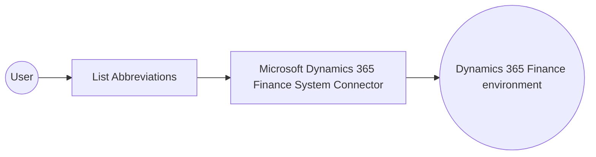

# Example

## What you'll build

This example builds an automation that connects to Microsoft Dynamics 365 Finance System and lists the address abbreviations configured in the environment. The automation logs the retrieved collection so you can confirm the connection and operation work end-to-end.

**Operations used:**
- **List Abbreviations** : Retrieves the address abbreviation records configured in the Microsoft Dynamics 365 Finance environment.

## Architecture

## Prerequisites

- A Microsoft Entra ID application registered with Dynamics 365 Finance and Operations API permissions, along with its client ID, client secret, and token URL for the OAuth2 client-credentials grant.
- The service URL of the target Microsoft Dynamics 365 Finance environment (for example, `https://<your-org>.operations.dynamics.com/data`).

- The application must be registered as a user in the target Dynamics 365 Finance and Operations environment and assigned the security roles required for this connector's operations.

## Setting up the Microsoft Dynamics 365 Finance System integration

> **New to WSO2 Integrator?** Follow the [Create a New Integration](../../../../develop/create-integrations/create-a-new-integration.md) guide to set up your integration first, then return here to add the connector.

## Adding the Microsoft Dynamics 365 Finance System connector

### Step 1: Open the connector palette

Select **Add Connection** in the **Connections** section.

### Step 2: Select the Microsoft Dynamics 365 Finance System connector

1. Enter `microsoft.dynamics365.finance.system` in the search field.
2. Select the **System** connector card.

## Configuring the Microsoft Dynamics 365 Finance System connection

### Step 3: Bind the connection parameters to configurable variables

Bind every required connection field to a configurable variable.

- **Config** : The `auth` record, bound to the `tokenUrl`, `clientId`, and `clientSecret` configurables through the expression `{auth: {tokenUrl, clientId, clientSecret, scopes}}`.
- **Service Url** : The target environment's OData endpoint, bound to the `serviceUrl` configurable.

### Step 4: Save the connection

Select **Save Connection** and verify that the connection appears in the **Connections** section.

### Step 5: Set actual values for your configurables

1. Select **Configurations** at the bottom of the project tree under **Data Mappers**.
2. Enter a value for each configurable listed below before you run the integration.

- **tokenUrl** (`string`) : The OAuth2 token endpoint for the Microsoft Entra ID application.
- **clientId** (`string`) : The client ID of the registered Microsoft Entra ID application.
- **clientSecret** (`string`) : The client secret of the registered Microsoft Entra ID application.
- **scopes** (`string[]`) : The OAuth2 scope requested for the client-credentials token, set to the environment base URL followed by `/.default`
- **serviceUrl** (`string`) : The OData endpoint of the target Microsoft Dynamics 365 Finance environment.

## Configuring the Microsoft Dynamics 365 Finance System List Abbreviations operation

### Step 6: Add an automation entry point

1. Select **Add Entry Point** next to **Entry Points**.
2. Select **Automation**.
3. Select **Create** to accept the settings.

### Step 7: Expand the connection and configure the List Abbreviations operation

1. Select the **+** icon on the automation flow.
2. Expand **systemClient** to display its operations.

3. Select **List Abbreviations**. This operation has no required parameters, so the default result variable name is used as generated.

4. Select **Save**.

### Step 8: Log the List Abbreviations result

1. Select the **+** icon on the connecting line between the operation and **Error Handler**.
2. Expand **Logging** and select **Log Info**.
3. Switch **Msg** to expression mode and enter `systemAbbreviationscollection.toJsonString()`.
4. Select **Save**.

## Try it yourself

Try this sample in WSO2 Integration Platform.

[View source on GitHub](https://github.com/wso2/integration-samples/tree/main/integrator-default-profile/connectors/microsoft_dynamics365_finance_system_connector_sample)

## More code examples

The Dynamics 365 Finance Ballerina connectors provide practical examples illustrating usage in various scenarios.
Explore these [examples](https://github.com/ballerina-platform/module-ballerinax-microsoft.dynamics365.finance/tree/main/examples).
