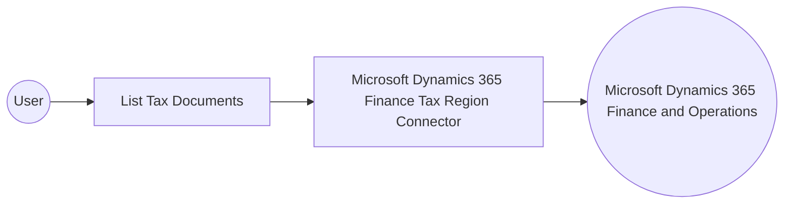

# Example

## What you'll build

This example builds an automation that connects to Microsoft Dynamics 365 Finance and retrieves tax documents through the Microsoft Dynamics 365 Finance Tax Region connector. The automation runs the list operation against the Dynamics 365 Finance and Operations OData endpoint and logs the returned collection so you can confirm the connection and operation values.

**Operations used:**
- **List Tax Documents** : Retrieves tax documents and their associated credit memo amounts for customer and vendor transactions.

## Architecture

## Prerequisites

- A Microsoft Entra ID application registered with Dynamics 365 API permissions and added as a user in the target Dynamics 365 Finance environment, secured with OAuth2 client credentials.
- The service URL of the target Microsoft Dynamics 365 Finance and Operations environment.

- The application must be registered as a user in the target Dynamics 365 Finance and Operations environment and assigned the security roles required for this connector's operations.

## Setting up the Microsoft Dynamics 365 Finance Tax Region integration

> **New to WSO2 Integrator?** Follow the [Create a New Integration](../../../../develop/create-integrations/create-a-new-integration.md) guide to set up your integration first, then return here to add the connector.

## Adding the Microsoft Dynamics 365 Finance Tax Region connector

### Step 1: Open the connector palette

Select **Add Connection** in the **Connections** section.

### Step 2: Select the Microsoft Dynamics 365 Finance Tax Region connector

1. Enter `microsoft.dynamics365.finance.taxregion` in the search field.
2. Select the **Taxregion** connector card.

## Configuring the Microsoft Dynamics 365 Finance Tax Region connection

### Step 3: Bind the connection parameters to configurable variables

Bind the authentication and endpoint fields to configurable variables before you save the connection.

- **Config** : Switch to an expression that binds the auth record to the tokenUrl, clientId, clientSecret, and scopes configurables. Enter the expression `{auth: {tokenUrl, clientId, clientSecret, scopes}}`.
- **Service Url** : Open the helper panel and bind this field to a new configurable through the Configurables tab. Use the OData root, for example `https://<your-org>.operations.dynamics.com/data`.

### Step 4: Save the connection

Select **Save Connection** and verify that the connection appears in the **Connections** section.

### Step 5: Set actual values for your configurables

1. Select **Configurations** at the bottom of the project tree under **Data Mappers**.
2. Enter a value for each configurable listed below before you run the integration.

- **tokenUrl** (`string`) : The OAuth2 token endpoint used to obtain an access token for the client credentials grant.
- **clientId** (`string`) : The Microsoft Entra ID application client identifier.
- **clientSecret** (`string`) : The Microsoft Entra ID application client secret.
- **scopes** (`string[]`) : The OAuth2 scope requested for the client-credentials token, set to the environment base URL followed by `/.default`
- **serviceUrl** (`string`) : The base URL of the target Microsoft Dynamics 365 Finance and Operations environment.

## Configuring the Microsoft Dynamics 365 Finance Tax Region List Tax Documents operation

### Step 6: Add an automation entry point

1. Select **Add Entry Point** next to **Entry Points**.
2. Select **Automation**.
3. Select **Create** to accept the settings.

### Step 7: Expand the connection and configure the List Tax Documents operation

1. Select the automation flow's connecting node between **Start** and **Error Handler**.
2. Expand **taxregionClient** to display its operations.

3. Select **List Tax Documents**. This operation has no required parameters, so the default result variable is sufficient.

4. Select **Save**.

### Step 8: Log the List Tax Documents result

Expand **Logging**, select **Log Info**, switch **Msg** to an expression, and enter `taxregionTaxdocumentscollection.toJsonString()` to surface the returned collection. Save the log step and return to the visual flow.

## Try it yourself

Try this sample in WSO2 Integration Platform.

[View source on GitHub](https://github.com/wso2/integration-samples/tree/main/integrator-default-profile/connectors/microsoft_dynamics365_finance_taxregion_connector_sample)

## More code examples

The Dynamics 365 Finance Ballerina connectors provide practical examples illustrating usage in various scenarios.
Explore these [examples](https://github.com/ballerina-platform/module-ballerinax-microsoft.dynamics365.finance/tree/main/examples).
