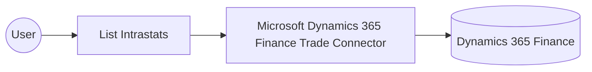

# Example

## What you'll build

This example builds an automation that connects to Microsoft Dynamics 365 Finance Trade and retrieves Intrastat declarations used for cross-border movement of goods reporting. The automation runs the operation and logs the result, giving you a working starting point for trade compliance and statutory reporting integrations.

**Operations used:**
- **List Intrastats** : Reads all Intrastat declarations in the system.

## Architecture

## Prerequisites

- A Microsoft Entra ID app registration with client credentials (client ID and client secret) authorized to call the Dynamics 365 Finance and Operations OData API.
- The service URL of your Dynamics 365 Finance and Operations environment.

- The application must be registered as a user in the target Dynamics 365 Finance and Operations environment and assigned the security roles required for this connector's operations.

## Setting up the Microsoft Dynamics 365 Finance Trade integration

> **New to WSO2 Integrator?** Follow the [Create a New Integration](../../../../develop/create-integrations/create-a-new-integration.md) guide to set up your integration first, then return here to add the connector.

## Adding the Microsoft Dynamics 365 Finance Trade connector

### Step 1: Open the connector palette

Select **Add Connection** in the **Connections** section.

### Step 2: Select the Microsoft Dynamics 365 Finance Trade connector

1. Enter `microsoft.dynamics365.finance.trade` in the search field.
2. Select the **Trade** connector card.

## Configuring the Microsoft Dynamics 365 Finance Trade connection

### Step 3: Bind the connection parameters to configurable variables

Bind every required connection field to a configurable variable.

- **Config** : The configurations, including the `tokenUrl`, `clientId`, and `clientSecret` used to initialize the connector. Enter the expression `{auth: {tokenUrl, clientId, clientSecret, scopes}}`.
- **Service Url** : URL of the target Microsoft Dynamics 365 Finance and Operations environment. Use the OData root, for example `https://<your-org>.operations.dynamics.com/data`.

### Step 4: Save the connection

Select **Save Connection** and verify that the connection appears in the **Connections** section.

### Step 5: Set actual values for your configurables

1. Select **Configurations** at the bottom of the project tree under **Data Mappers**.
2. Enter a value for each configurable listed below before you run the integration.

- **tokenUrl** (`configurable string`) : The Microsoft Entra ID token endpoint URL used to obtain an access token.
- **clientId** (`configurable string`) : The client ID of the Microsoft Entra ID app registration.
- **clientSecret** (`configurable string`) : The client secret of the Microsoft Entra ID app registration.
- **scopes** (`string[]`) : The OAuth2 scope requested for the client-credentials token, set to the environment base URL followed by `/.default`
- **serviceUrl** (`configurable string`) : The URL of the target Microsoft Dynamics 365 Finance and Operations environment.

## Configuring the Microsoft Dynamics 365 Finance Trade List Intrastats operation

### Step 6: Add an automation entry point

1. Select **Add Entry Point** next to **Entry Points**.
2. Select **Automation**.
3. Select **Create** to accept the settings.

### Step 7: Expand the connection and configure the List Intrastats operation

1. Select the add icon on the automation flow.
2. Expand **tradeClient** to display its operations.

3. Select **List Intrastats**. This operation has no required parameters.

4. Select **Save**.

### Step 8: Log the List Intrastats result

Add a **Log Info** action, switch its **Msg** field to expression mode, and enter `tradeIntrastatscollection.toJsonString()` to log the result. Return to the visual flow to confirm the complete chain.

## Try it yourself

Try this sample in WSO2 Integration Platform.

[View source on GitHub](https://github.com/wso2/integration-samples/tree/main/integrator-default-profile/connectors/microsoft_dynamics365_finance_trade_connector_sample)

## More code examples

The Dynamics 365 Finance Ballerina connectors provide practical examples illustrating usage in various scenarios.
Explore these [examples](https://github.com/ballerina-platform/module-ballerinax-microsoft.dynamics365.finance/tree/main/examples).
