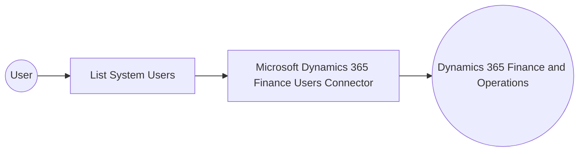

# Example

## What you'll build

This example builds an automation that connects to Microsoft Dynamics 365 Finance Users and lists the system user accounts configured in a Dynamics 365 Finance and Operations environment. The integration retrieves the collection of system users and logs the result as JSON.

**Operations used:**
- **List System Users** : Lists system users, optionally filtered with OData query parameters.

## Architecture

## Prerequisites

- A Microsoft Dynamics 365 Finance and Operations environment (cloud-hosted or sandbox).
- An Azure Active Directory (Entra ID) app registration with API permissions for Dynamics 365, including an OAuth2 token endpoint, client ID, and client secret.

- The application must be registered as a user in the target Dynamics 365 Finance and Operations environment and assigned the security roles required for this connector's operations.

## Setting up the Microsoft Dynamics 365 Finance Users integration

> **New to WSO2 Integrator?** Follow the [Create a New Integration](../../../../develop/create-integrations/create-a-new-integration.md) guide to set up your integration first, then return here to add the connector.

## Adding the Microsoft Dynamics 365 Finance Users connector

### Step 1: Open the connector palette

Select **Add Connection** in the **Connections** section.

### Step 2: Select the Microsoft Dynamics 365 Finance Users connector

1. Enter `microsoft.dynamics365.finance.users` in the search field.
2. Select the **Users** connector card.

## Configuring the Microsoft Dynamics 365 Finance Users connection

### Step 3: Bind the connection parameters to configurable variables

Bind the authentication and service fields to configurable variables.

- **Config** : Bind to the expression `{auth: {tokenUrl, clientId, clientSecret, scopes}}`, referencing three configurable variables for the OAuth2 client-credentials grant.
- **Service Url** : Bind to the `serviceUrl` configurable variable, which holds the target Dynamics 365 Finance and Operations environment URL. Use the OData root, for example `https://<your-org>.operations.dynamics.com/data`.

### Step 4: Save the connection

Select **Save Connection** and verify that the connection appears in the **Connections** section.

### Step 5: Set actual values for your configurables

1. Select **Configurations** at the bottom of the project tree under **Data Mappers**.
2. Enter a value for each configurable listed below before you run the integration.

- **tokenUrl** (`string`) : The OAuth2 token endpoint URL for Microsoft Entra ID.
- **clientId** (`string`) : The Azure AD application (client) ID.
- **clientSecret** (`string`) : The Azure AD application client secret.
- **scopes** (`string[]`) : The OAuth2 scope requested for the client-credentials token, set to the environment base URL followed by `/.default`
- **serviceUrl** (`string`) : The base URL of the target Dynamics 365 Finance and Operations environment.

## Configuring the Microsoft Dynamics 365 Finance Users List System Users operation

### Step 6: Add an automation entry point

1. Select **Add Entry Point** next to **Entry Points**.
2. Select **Automation**.
3. Select **Create** to accept the settings.

### Step 7: Expand the connection and configure the List System Users operation

1. Select the **+** icon on the automation flow.
2. Expand **usersClient** to display its operations.

3. Select **List System Users**. This operation has no required parameters, so the default settings are ready to save.

4. Select **Save**.

### Step 8: Log the List System Users result

1. Select the **+** icon between the operation node and **Error Handler**.
2. Expand **Logging** and select **Log Info**.
3. Switch the **Msg** field to expression mode and enter `usersSystemuserscollection.toJsonString()` to log the result.
4. Select **Save**.

## Try it yourself

Try this sample in WSO2 Integration Platform.

[View source on GitHub](https://github.com/wso2/integration-samples/tree/main/integrator-default-profile/connectors/microsoft_dynamics365_finance_users_connector_sample)

## More code examples

The Dynamics 365 Finance Ballerina connectors provide practical examples illustrating usage in various scenarios.
Explore these [examples](https://github.com/ballerina-platform/module-ballerinax-microsoft.dynamics365.finance/tree/main/examples).
