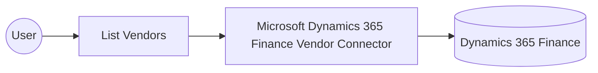

# Example

## What you'll build

This example builds an automation that connects to Microsoft Dynamics 365 Finance Vendor and retrieves the full list of vendor master records for a legal entity. The integration authenticates with Microsoft Entra ID using the OAuth2 client credentials grant, lists the vendors, and logs the result as JSON.

**Operations used:**
- **List Vendors** : Reads all vendor master records in the system.

## Architecture

## Prerequisites

- A Microsoft Dynamics 365 Finance and Operations environment (cloud-hosted or sandbox).
- A Microsoft Entra ID application registration with API permissions granted for Dynamics 365 Finance and Operations, including a client ID, a client secret, and a token URL.

- The application must be registered as a user in the target Dynamics 365 Finance and Operations environment and assigned the security roles required for this connector's operations.

## Setting up the Microsoft Dynamics 365 Finance Vendor integration

> **New to WSO2 Integrator?** Follow the [Create a New Integration](../../../../develop/create-integrations/create-a-new-integration.md) guide to set up your integration first, then return here to add the connector.

## Adding the Microsoft Dynamics 365 Finance Vendor connector

### Step 1: Open the connector palette

Select **Add Connection** in the **Connections** section.

### Step 2: Select the Microsoft Dynamics 365 Finance Vendor connector

1. Enter `microsoft.dynamics365.finance.vendor` in the search field.
2. Select the **Vendor** connector card.

## Configuring the Microsoft Dynamics 365 Finance Vendor connection

### Step 3: Bind the connection parameters to configurable variables

Bind the connection parameters to configurable variables before saving the connection.

1. Open the **Config** field's record view and select **auth**, which pulls in the OAuth2 client-credentials grant fields, then also select **tokenUrl** and **scopes**.
2. Switch **Config** to expression mode and enter `{auth: {tokenUrl, clientId, clientSecret, scopes}}`, referencing the configurable variables created for those fields.
3. Open the **Service Url** field's helper panel, select **Configurables**, and create a new configurable named `serviceUrl`.

- **Config** : The connection settings, including the OAuth2 client-credentials authentication values.
- **Service Url** : URL of the target Microsoft Dynamics 365 Finance and Operations environment. Use the OData root, for example `https://<your-org>.operations.dynamics.com/data`.

### Step 4: Save the connection

Select **Save Connection** and verify that the connection appears in the **Connections** section.

### Step 5: Set actual values for your configurables

1. Select **Configurations** at the bottom of the project tree under **Data Mappers**.
2. Enter a value for each configurable listed below before you run the integration.

- **tokenUrl** (`string`) : The Microsoft Entra ID OAuth2 token endpoint for the tenant.
- **clientId** (`string`) : The Microsoft Entra ID application (client) ID.
- **clientSecret** (`string`) : The Microsoft Entra ID application client secret.
- **scopes** (`string[]`) : The OAuth2 scope requested for the client-credentials token, set to the environment base URL followed by `/.default`
- **serviceUrl** (`string`) : The base URL of the target Microsoft Dynamics 365 Finance and Operations environment.

## Configuring the Microsoft Dynamics 365 Finance Vendor List Vendors operation

### Step 6: Add an automation entry point

1. Select **Add Entry Point** next to **Entry Points**.
2. Select **Automation**.
3. Select **Create** to accept the settings.

### Step 7: Expand the connection and configure the List Vendors operation

1. Select the add icon in the automation flow.
2. Expand **vendorClient** to display its operations.

3. Select **List Vendors**. This operation has no required values, so the default settings and the auto-generated `vendorVendorscollection` result variable are ready to save.

4. Select **Save**.

### Step 8: Log the List Vendors result

Add a **Log Info** action, switch its **Msg** field to expression mode, and enter `vendorVendorscollection.toJsonString()` to log the result.

## Try it yourself

Try this sample in WSO2 Integration Platform.

[View source on GitHub](https://github.com/wso2/integration-samples/tree/main/integrator-default-profile/connectors/microsoft_dynamics365_finance_vendor_connector_sample)

## More code examples

The Dynamics 365 Finance Ballerina connectors provide practical examples illustrating usage in various scenarios.
Explore these [examples](https://github.com/ballerina-platform/module-ballerinax-microsoft.dynamics365.finance/tree/main/examples).
