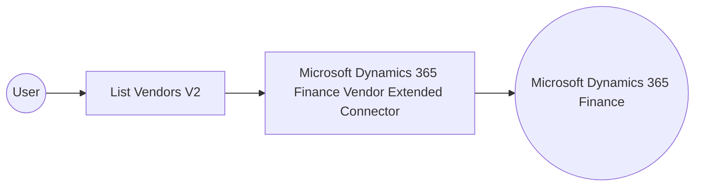

# Example

## What you'll build

This example builds an automation that connects to Microsoft Dynamics 365 Finance and retrieves extended vendor records through the Vendor Extended connector. The flow lists the version 2 vendor collection and logs the result for inspection.

**Operations used:**
- **List Vendors V2** : Retrieves the collection of extended vendor master records from the connected Microsoft Dynamics 365 Finance environment.

## Architecture

## Prerequisites

- A Microsoft Dynamics 365 Finance and Operations environment, cloud-hosted or sandbox.
- An Azure Active Directory (Entra ID) application registration with API permissions for Microsoft Dynamics 365, including its client ID, client secret, and token URL.

- The application must be registered as a user in the target Dynamics 365 Finance and Operations environment and assigned the security roles required for this connector's operations.

## Setting up the Microsoft Dynamics 365 Finance Vendor Extended integration

> **New to WSO2 Integrator?** Follow the [Create a New Integration](../../../../develop/create-integrations/create-a-new-integration.md) guide to set up your integration first, then return here to add the connector.

## Adding the Microsoft Dynamics 365 Finance Vendor Extended connector

### Step 1: Open the connector palette

Select **Add Connection** in the **Connections** section.

### Step 2: Select the Microsoft Dynamics 365 Finance Vendor Extended connector

1. Enter `microsoft.dynamics365.finance.vendorextended` in the search field.
2. Select the **Vendorextended** connector card.

## Configuring the Microsoft Dynamics 365 Finance Vendor Extended connection

### Step 3: Bind the connection parameters to configurable variables

Bind every required connection field to a configurable variable.

- **Config** : An expression referencing the `auth` record, which carries the `tokenUrl`, `clientId`, and `clientSecret` configurables for the OAuth2 client-credentials grant. Enter the expression `{auth: {tokenUrl, clientId, clientSecret, scopes}}`.
- **Service Url** : The base URL of the target Microsoft Dynamics 365 Finance and Operations environment, bound to the `serviceUrl` configurable. Use the OData root, for example `https://<your-org>.operations.dynamics.com/data`.

### Step 4: Save the connection

Select **Save Connection** and verify that the connection appears in the **Connections** section.

### Step 5: Set actual values for your configurables

1. Select **Configurations** at the bottom of the project tree under **Data Mappers**.
2. Enter a value for each configurable listed below before you run the integration.

- **tokenUrl** (`string`) : The OAuth2 token endpoint URL for the Azure AD application registration.
- **clientId** (`string`) : The application (client) ID of the Azure AD application registration.
- **clientSecret** (`string`) : The client secret generated for the Azure AD application registration.
- **scopes** (`string[]`) : The OAuth2 scope requested for the client-credentials token, set to the environment base URL followed by `/.default`
- **serviceUrl** (`string`) : The base URL of the target Microsoft Dynamics 365 Finance and Operations environment.

## Configuring the Microsoft Dynamics 365 Finance Vendor Extended List Vendors V2 operation

### Step 6: Add an automation entry point

1. Select **Add Entry Point** next to **Entry Points**.
2. Select **Automation**.
3. Select **Create** to accept the settings.

### Step 7: Expand the connection and configure the List Vendors V2 operation

1. Select the add icon on the automation flow.
2. Expand **vendorextendedClient** to display its operations.

3. Select **List Vendors V2**. This operation has no required parameters.

4. Select **Save**.

### Step 8: Log the List Vendors V2 result

Add a **Log Info** action, switch its **Msg** field to expression mode, and enter `vendorextendedVendorsv2collection.toJsonString()` to log the result.

## Try it yourself

Try this sample in WSO2 Integration Platform.

[View source on GitHub](https://github.com/wso2/integration-samples/tree/main/integrator-default-profile/connectors/microsoft_dynamics365_finance_vendorextended_connector_sample)

## More code examples

The Dynamics 365 Finance Ballerina connectors provide practical examples illustrating usage in various scenarios.
Explore these [examples](https://github.com/ballerina-platform/module-ballerinax-microsoft.dynamics365.finance/tree/main/examples).
