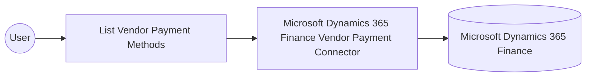

# Example

## What you'll build

This example builds an automation that connects to Microsoft Dynamics 365 Finance and retrieves the configured vendor payment methods through the Microsoft Dynamics 365 Finance Vendor Payment connector. The automation logs the returned collection so you can confirm the connection and operation work end to end.

**Operations used:**
- **List Vendor Payment Methods** : Retrieves a collection of vendor payment methods from Microsoft Dynamics 365 Finance.

## Architecture

## Prerequisites

- A Microsoft Dynamics 365 Finance and Operations environment, either cloud-hosted or sandbox.
- A Microsoft Entra ID (Azure Active Directory) app registration with API permissions for Dynamics 365 Finance, providing a token URL, client ID, and client secret for the OAuth2 client-credentials grant.

- The application must be registered as a user in the target Dynamics 365 Finance and Operations environment and assigned the security roles required for this connector's operations.

## Setting up the Microsoft Dynamics 365 Finance Vendor Payment integration

> **New to WSO2 Integrator?** Follow the [Create a New Integration](../../../../develop/create-integrations/create-a-new-integration.md) guide to set up your integration first, then return here to add the connector.

## Adding the Microsoft Dynamics 365 Finance Vendor Payment connector

### Step 1: Open the connector palette

Select **Add Connection** in the **Connections** section.

### Step 2: Select the Microsoft Dynamics 365 Finance Vendor Payment connector

1. Enter `microsoft.dynamics365.finance.vendorpayment` in the search field.
2. Select the **Vendorpayment** connector card.

## Configuring the Microsoft Dynamics 365 Finance Vendor Payment connection

### Step 3: Bind the connection parameters to configurable variables

Bind the authentication fields and the service URL to configurable variables.

1. Check the **auth** field, along with its **tokenUrl** field, in the record configuration panel to pull in the OAuth2 client-credentials fields.
2. Switch **Config** to expression mode and enter `{auth: {tokenUrl, clientId, clientSecret, scopes}}`, referencing three configurables created under **Configurations**.
3. Open the **Service Url** field's helper panel, select **Configurables**, and create a new configurable named `serviceUrl`.

- **Config** : The OAuth2 client-credentials configuration used to authenticate with Microsoft Entra ID.
- **Service Url** : URL of the target Microsoft Dynamics 365 Finance and Operations environment. Use the OData root, for example `https://<your-org>.operations.dynamics.com/data`.

### Step 4: Save the connection

Select **Save Connection** and verify that `vendorpaymentClient` appears in the **Connections** section.

### Step 5: Set actual values for your configurables

1. Select **Configurations** at the bottom of the project tree under **Data Mappers**.
2. Enter a value for each configurable listed below before you run the integration.

- **tokenUrl** (`string`) : Token endpoint URL for the Microsoft Entra ID OAuth2 client-credentials grant.
- **clientId** (`string`) : Client ID of the Microsoft Entra ID app registration.
- **clientSecret** (`string`) : Client secret of the Microsoft Entra ID app registration.
- **scopes** (`string[]`) : The OAuth2 scope requested for the client-credentials token, set to the environment base URL followed by `/.default`
- **serviceUrl** (`string`) : Base URL of the target Microsoft Dynamics 365 Finance and Operations environment.

## Configuring the Microsoft Dynamics 365 Finance Vendor Payment List Vendor Payment Methods operation

### Step 6: Add an automation entry point

1. Select **Add Entry Point** next to **Entry Points**.
2. Select **Automation**.
3. Select **Create** to accept the settings.

### Step 7: Expand the connection and configure the List Vendor Payment Methods operation

1. Select the **+** icon on the automation flow.
2. Expand **vendorpaymentClient** to display its operations.

3. Select **List Vendor Payment Methods**. This operation has no required parameters, so the default settings are ready to save.

4. Select **Save**.

### Step 8: Log the List Vendor Payment Methods result

Select the **+** icon on the connecting line between the operation node and **Error Handler**, expand **Logging**, and select **Log Info**. Switch its **Msg** field to expression mode, and enter `vendorpaymentVendorpaymentmethodscollection.toJsonString()` to log the result.

## Try it yourself

Try this sample in WSO2 Integration Platform.

[View source on GitHub](https://github.com/wso2/integration-samples/tree/main/integrator-default-profile/connectors/microsoft_dynamics365_finance_vendorpayment_connector_sample)

## More code examples

The Dynamics 365 Finance Ballerina connectors provide practical examples illustrating usage in various scenarios.
Explore these [examples](https://github.com/ballerina-platform/module-ballerinax-microsoft.dynamics365.finance/tree/main/examples).
