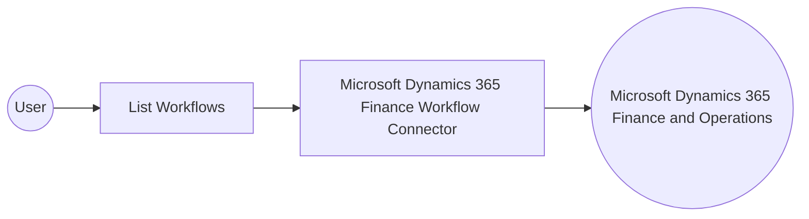

# Example

## What you'll build

Build an integration that connects to Microsoft Dynamics 365 Finance Workflow and lists the workflow definitions configured in a Microsoft Dynamics 365 Finance and Operations environment. The integration authenticates with OAuth2 client credentials, retrieves the workflow collection, and logs the result for inspection.

**Operations used:**
- **List Workflows** : Lists the workflow definitions configured in the Microsoft Dynamics 365 Finance and Operations environment.

## Architecture

## Prerequisites

- A Microsoft Entra ID app registration with a client ID and a client secret configured for the OAuth2 client credentials grant
- The OAuth2 token endpoint URL for your Microsoft Entra ID tenant
- The service URL of your Microsoft Dynamics 365 Finance and Operations environment

- The application must be registered as a user in the target Dynamics 365 Finance and Operations environment and assigned the security roles required for this connector's operations.

## Setting up the Microsoft Dynamics 365 Finance Workflow integration

> **New to WSO2 Integrator?** Follow the [Create a New Integration](../../../../develop/create-integrations/create-a-new-integration.md) guide to set up your integration first, then return here to add the connector.

## Adding the Microsoft Dynamics 365 Finance Workflow connector

### Step 1: Open the connector palette

Select **Add Connection** in the **Connections** section.

### Step 2: Select the Microsoft Dynamics 365 Finance Workflow connector

1. Enter `microsoft.dynamics365.finance.workflow` in the search field.
2. Select the **Microsoft Dynamics 365 Finance Workflow** connector card.

## Configuring the Microsoft Dynamics 365 Finance Workflow connection

### Step 3: Bind the connection parameters to configurable variables

1. Open the **Config** field's helper panel, select the **Configurables** tab, and create three string configurable variables named `tokenUrl`, `clientId`, and `clientSecret`.
2. Switch **Config** from **Record** to **Expression** mode and enter an expression that references the three configurable variables under an `auth` record.
3. Open the **Service Url** field's helper panel, select the **Configurables** tab, and create a string configurable variable named `serviceUrl`.

- **Config** : The authentication settings used to connect to Microsoft Dynamics 365 Finance Workflow. Enter the expression `{auth: {tokenUrl, clientId, clientSecret, scopes}}`.
- **Service Url** : The address of the target Microsoft Dynamics 365 Finance and Operations environment. Use the OData root, for example `https://<your-org>.operations.dynamics.com/data`.

### Step 4: Save the connection

Select **Save** and verify that the connection appears in the **Connections** section.

### Step 5: Set actual values for your configurables

1. Select **Configurations** at the bottom of the project tree under **Data Mappers**.
2. Enter a value for each configurable listed below before you run the integration.

- **tokenUrl** (`string`) : The OAuth2 token endpoint URL for your Microsoft Entra ID tenant.
- **clientId** (`string`) : The client ID of your Microsoft Entra ID app registration.
- **clientSecret** (`string`) : The client secret of your Microsoft Entra ID app registration.
- **scopes** (`string[]`) : The OAuth2 scope requested for the client-credentials token, set to the environment base URL followed by `/.default`
- **serviceUrl** (`string`) : The address of the target Microsoft Dynamics 365 Finance and Operations environment.

## Configuring the Microsoft Dynamics 365 Finance Workflow List Workflows operation

### Step 6: Add an automation entry point

1. Select **Add Entry Point** next to **Entry Points**.
2. Select **Automation**.
3. Select **Create** to accept the settings.

### Step 7: Expand the connection and configure the List Workflows operation

1. Select the node panel's **+** control on the automation canvas.
2. Expand **workflowClient** to display its operations.

3. Select **List Workflows**. This operation has no required parameters.

4. Select **Save**.

### Step 8: Log the List Workflows result

1. Select the **+** control on the connecting line leading to **Error Handler**.
2. Select **Logging**, then select **Log Info**.
3. Switch **Msg** from **Text** to **Expression** mode and enter `workflowWorkflowscollection.toJsonString()` to log the result.
4. Select **Save**.

## Try it yourself

Try this sample in WSO2 Integration Platform.

[View source on GitHub](https://github.com/wso2/integration-samples/tree/main/integrator-default-profile/connectors/microsoft_dynamics365_finance_workflow_connector_sample)

## More code examples

The Dynamics 365 Finance Ballerina connectors provide practical examples illustrating usage in various scenarios.
Explore these [examples](https://github.com/ballerina-platform/module-ballerinax-microsoft.dynamics365.finance/tree/main/examples).
