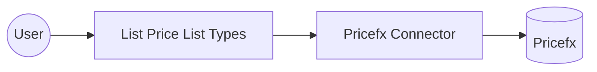

# Example

## What you'll build

This example builds an automation that connects to Pricefx and lists the price list types defined in your partition. The automation calls the **List Price List Types** operation and logs the result.

**Operations used:**
- **List Price List Types** : Retrieves the price list types configured for your partition.

## Architecture

## Prerequisites

- A Pricefx username, password, and partition. See the connector's [Setup Guide](setup-guide.md).

## Setting up the Pricefx integration

> **New to WSO2 Integrator?** Follow the [Create a New Integration](../../../../develop/create-integrations/create-a-new-integration.md) guide to set up your integration first, then return here to add the connector.

## Adding the Pricefx connector

### Step 1: Open the connector palette

Select **Add Connection** in the **Connections** section.

### Step 2: Select the Pricefx connector

Enter "pricefx" in the search box to filter the connector list, then select the **Pricefx** connector card (`ballerinax/pricefx`) to open its connection configuration form.

## Configuring the Pricefx connection

### Step 3: Bind the connection parameters to configurable variables

Bind the required connection fields to configurable variables.

- **Config** : The authentication method to use. Select **BasicCredentials** and bind its `username`, `password`, and `partition` fields.

### Step 4: Save the connection

Select **Save Connection** and verify that the connection appears in the **Connections** section.

### Step 5: Set actual values for your configurables

1. Select **Configurations** at the bottom of the project tree under **Data Mappers**.
2. Enter a value for each configurable listed below before you run the integration.

- **username** (`string`) : Your Pricefx username.
- **password** (`string`) : Your Pricefx password.
- **partition** (`string`) : Your Pricefx partition name.

## Configuring the Pricefx List Price List Types operation

### Step 6: Add an automation entry point

1. In the left panel under **Entry Points**, select **+** (**Add Entry Point**).
2. Under **Automation**, select **Automation**.
3. In the **Create New Automation** dialog, accept the default settings and select **Create**.

The canvas switches to the Automation flow view, showing a Start node, an Error Handler node, and an End node.

### Step 7: Select the List Price List Types operation

1. In the automation flow body on the canvas, select the **+** (Add Step) button between the Start and Error Handler nodes to open the step-addition panel.
2. Under **Connections** in the step panel, select the **pricefxClient** connection node to expand it and reveal all available Pricefx API operations.

3. Select **List Price List Types** from the list. This operation has no required parameters, so only the result variable needs a name.

- **Result** : The name of the variable that holds the returned price list types.

4. Select **Save** to add the Pricefx operation step to the automation flow.

### Step 8: Log the List Price List Types result

Add a log action for the returned value, then return to the visual flow.

## Try it yourself

Try this sample in WSO2 Integration Platform.

[View source on GitHub](https://github.com/wso2/integration-samples/tree/main/integrator-default-profile/connectors/pricefx_connector_sample)

## More code examples

The `Pricefx` connector offers practical examples illustrating its use in various scenarios.
Explore these [examples](https://github.com/ballerina-platform/module-ballerinax-pricefx/tree/main/examples/), covering the following use cases:

1. [Product catalog management](https://github.com/ballerina-platform/module-ballerinax-pricefx/tree/main/examples/product-catalog-management): Add a new product to the catalog, update one of its fields, then list matching products to confirm the change.
2. [Customer quote workflow](https://github.com/ballerina-platform/module-ballerinax-pricefx/tree/main/examples/customer-quote-workflow): Add a new customer, create a quote for them, then submit the quote for approval.
3. [Price list calculation](https://github.com/ballerina-platform/module-ballerinax-pricefx/tree/main/examples/price-list-calculation): Create a new price list, run its calculation, then fetch the calculated price list.
4. [Attachment upload workflow](https://github.com/ballerina-platform/module-ballerinax-pricefx/tree/main/examples/attachment-upload-workflow): Create an upload slot for a customer record, upload a file to it, then list the customer's files.
