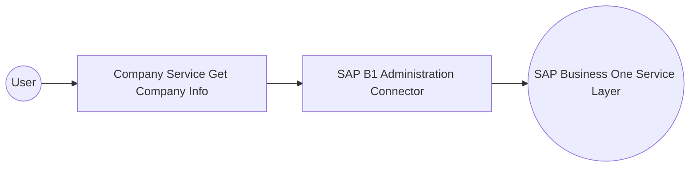

# Example

## What you'll build

Build an integration that connects to SAP Business One using the SAP Business One Administration connector and retrieves company information from a SAP B1 Service Layer endpoint. The integration sets up an automation entry point that invokes the company info operation and returns structured company metadata.

**Operations used:**
- **Company Service Get Company Info** : Retrieves metadata about the connected SAP B1 company database, including company name, version, and currency

## Architecture

## Prerequisites

- Access to a SAP Business One Service Layer endpoint
- SAP B1 company database name, username, and password

## Setting up the SAP Business One Administration integration

> **New to WSO2 Integrator?** Follow the [Create a New Integration](../../../../develop/create-integrations/create-a-new-integration.md) guide to set up your integration first, then return here to add the connector.

## Adding the SAP Business One Administration connector

### Step 1: Open the connector palette and add the SAP B1 Administration connector

1. From the project canvas, select **+ Add Artifact** → **Connection**.
2. In the connector search palette, enter `sap.businessone.administration`.
3. Locate **ballerinax/sap.businessone.administration** and select **Add**.

## Configuring the SAP Business One Administration connection

### Step 2: Fill in the connection parameters

Bind each connection field to a configurable variable to keep credentials out of source code.

- **session** : SAP B1 login credentials record containing `companyDb`, `username`, and `password` — bound to `sapCompanyDb`, `sapUsername`, and `sapPassword` configurable variables
- **serviceUrl** : Base URL of the SAP Business One Service Layer — bound to the `sapServiceUrl` configurable variable
- **connectionName** : Logical name for this connection — leave the default value `administrationClient`

### Step 3: Save the connection

Select **Save Connection**. The connection is saved and `administrationClient` appears in the **Connections** section of the project tree.

### Step 4: Set actual values for your configurables

1. In the left panel, select **Configurations**.
2. Set a value for each configurable listed below.

- **sapCompanyDb** (string) : The SAP B1 company database name (for example, `SBODEMOUS`)
- **sapUsername** (string) : The SAP B1 login username
- **sapPassword** (string) : The SAP B1 login password
- **sapServiceUrl** (string) : The base URL of the SAP Business One Service Layer (for example, `https://your-sap-b1-host/b1s/v1`)

## Configuring the SAP Business One Administration Company Service Get Company Info operation

### Step 5: Add an automation entry point

1. Select **+ Add Artifact**.
2. Select **Automation** to create an automation that can be invoked periodically or manually.
3. In the **Create New Automation** form, leave the default name and select **Create**.

The automation entry point `main` is added under **Entry Points** in the project tree and the flow canvas opens.

### Step 6: Select and configure the Company Service Get Company Info operation

1. In the automation flow canvas, select the **+** button between the **Start** node and the **Error Handler** node.
2. In the step-addition panel, expand **administrationClient** under the **Connections** section.
3. Scroll to the **Company** group and select **Company Service Get Company Info**.

Configure the operation with the following values:

- **resultVariable** : Auto-generated as `administrationCompanyinfo` — leave the default value

Select **Save**. The operation step is added to the automation flow.

## Try it yourself

Try this sample in WSO2 Integration Platform.

[View source on GitHub](https://github.com/wso2/integration-samples/tree/main/connectors/sapbusinessoneadministrationconnectorsample)

## More code examples

The SAP Business One connectors provide practical examples illustrating usage in various scenarios. Explore these
[examples](https://github.com/ballerina-platform/module-ballerinax-sap.businessone/tree/main/examples), covering
use cases like listing open sales orders, reporting inventory stock, and logging CRM activities.
