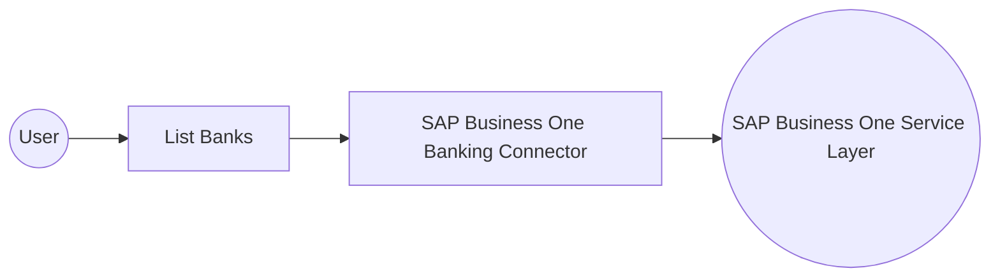

# Example

## What you'll build

Build an automation that retrieves the SAP Business One Banks collection. The flow uses the SAP Business One Banking connection, stores the returned collection, and writes an info log when the request completes.

**Operations used:**
- **List Banks** : Queries the Banks collection.

## Architecture

## Prerequisites

- An SAP Business One installation with the Service Layer enabled.
- A company database name, user name, and password for an SAP Business One account.

## Setting up the SAP Business One Banking integration

> **New to WSO2 Integrator?** Follow the [Create a New Integration](../../../../develop/create-integrations/create-a-new-integration.md) guide to set up your integration first, then return here to add the connector.

## Adding the SAP Business One Banking connector

### Step 1: Open the connector palette

Select **Add Connection** in the **Connections** section.

### Step 2: Select the SAP Business One Banking connector

1. Enter `sap.businessone.banking` in the search field.
2. Select the **Banking** connector card.

## Configuring the SAP Business One Banking connection

### Step 3: Bind the connection parameters to configurable variables

Enter the SAP Business One session details in **SessionConfig**.

- **companyDb** : SAP Business One company database name.
- **username** : SAP Business One user name.
- **password** : SAP Business One password.

### Step 4: Save the connection

Select **Save** and verify that `bankingClient` appears in the **Connections** section.

### Step 5: Set actual values for your configurables

1. Select **Configurations** at the bottom of the project tree under **Data Mappers**.
2. Enter the SAP Business One session values before you run the integration.

- **companyDb** (`string`) : SAP Business One company database name.
- **username** (`string`) : SAP Business One user name.
- **password** (`string`) : SAP Business One password.

## Configuring the SAP Business One Banking List Banks operation

### Step 6: Add an automation entry point

1. Select **Add Entry Point** next to **Entry Points**.
2. Select **Automation**.
3. Select **Create** to accept the settings.

### Step 7: Expand the connection and configure the List Banks operation

1. Select **Add Step** in the automation flow.
2. Expand **bankingClient** to display its operations.

3. Select **List Banks**.
4. Keep the generated result variable and response format.

- **Result** : Stores the Banks collection response.
- **Response format** : Uses `banking:BanksCollectionResponse` for the response.

5. Select **Save**.

### Step 8: Log the List Banks result

Add **Log Info** with the message `List Banks completed.`, then return to the visual flow.

## Try it yourself

Try this sample in WSO2 Integration Platform.

[View source on GitHub](https://github.com/wso2/integration-samples/tree/main/integrator-default-profile/connectors/sap_businessone_banking_connector_sample)

## More code examples

The SAP Business One connectors provide practical examples illustrating usage in various scenarios. Explore these
[examples](https://github.com/ballerina-platform/module-ballerinax-sap.businessone/tree/main/examples), covering
use cases like listing open sales orders, reporting inventory stock, and logging CRM activities.
