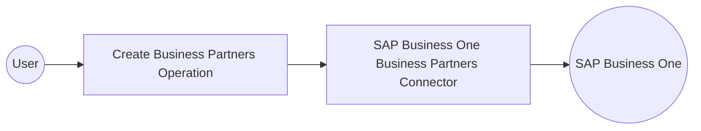

# Example

## What you'll build

This example creates a new Business Partner (customer, vendor, or lead) in an SAP Business One system through its Service Layer API. The integration binds connection credentials to configurable variables and creates a Business Partner record using the connector's create operation.

**Operations used:**
- **Create Business Partners** : creates a new Business Partner record in SAP Business One

## Architecture

## Prerequisites

- Access credentials for an SAP Business One Service Layer instance, including the company database name, username, and password.

## Setting up the SAP Business One Business Partners integration

> **New to WSO2 Integrator?** Follow the [Create a New Integration](../../../../develop/create-integrations/create-a-new-integration.md) guide to set up your integration first, then return here to add the connector.

## Adding the SAP Business One Business Partners connector

### Step 1: Open the Add Connection palette
Select **Add Connection** in the **Connections** section of the sidebar to open the connector palette. The palette shows options to create a connector from an OpenAPI or WSDL spec, connect to a database, or select a pre-built connector.

### Step 2: Locate and select the connector
1. Enter `sap.businessone.businesspartners` in the palette's search field.
2. Select the **Businesspartners** connector card to open the **Configure Businesspartners** connection form.

## Configuring the SAP Business One Business Partners connection

### Step 3: Bind connection parameters to configurable variables
Bind each field of the required **Session** record to a new configurable variable so the Service Layer credentials aren't hardcoded in the flow. Leave the optional **Config** and **Service Url** advanced fields at their defaults.
- **companyDb** : the SAP Business One company database name
- **username** : the Service Layer username
- **password** : the Service Layer password

### Step 4: Save the connection
Select **Save Connection** to add the **businesspartnersClient** connection node to the Connections panel and the design canvas.

### Step 5: Set actual values for your configurables
Select **Configurations** in the left panel, at the bottom of the project tree under Data Mappers, and set a value for each configurable variable.
- **companyDb** (string) : the SAP Business One company database name to connect to
- **username** (string) : the Service Layer username for authentication
- **password** (string) : the Service Layer password for authentication

## Configuring the SAP Business One Business Partners Create Business Partners operation

### Step 6: Add an Automation entry point
Select the **Automation** pattern from the entry-point palette to create a `main` automation artifact with a **Start** and **Error Handler** flow on the canvas.

### Step 7: Expand the connector's operations
1. Select the **+** node beneath **Start** to open the node panel.
2. Expand the **businesspartnersClient** connection entry to reveal every available operation, including Business Partner Groups, Contacts, Industries, Payment Terms, Relationships, Territories, and the primary Create, Get, List, Update, and Delete Business Partners operations.

### Step 8: Configure the Create Business Partners operation
1. Select **Create Business Partners** to open the `businesspartnersClient → createBusinessPartners` configuration form.
2. In the **Record Configuration** panel, enable the `CardCode`, `CardName`, and `CardType` fields and enter the values below.

- **CardCode** : `"C00001"`
- **CardName** : `"Acme Corp"`
- **CardType** : `"cCustomer"`, selected from the enum dropdown for a customer-type Business Partner

Close the **Record Configuration** panel and rename the operation's result variable to `result` (type `businesspartners:BusinessPartner`).

### Step 9: Save the operation node
Select **Save** to add the `businesspartners : createBusinessPartners` node to the canvas, wired between **Start** and **Error Handler**, with the **businesspartnersClient** connection as its target.

## Try it yourself

Try this sample in WSO2 Integration Platform.

[View source on GitHub](https://github.com/wso2/integration-samples/tree/main/connectors/sap_businessone_businesspartners_connector_sample)

## More code examples

The SAP Business One connectors provide practical examples illustrating usage in various scenarios. Explore these
[examples](https://github.com/ballerina-platform/module-ballerinax-sap.businessone/tree/main/examples), covering
use cases like listing open sales orders, reporting inventory stock, and logging CRM activities.
