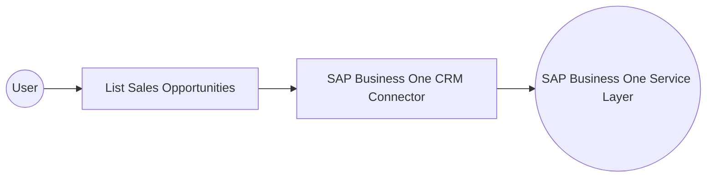

# Example

## What you'll build

This integration retrieves sales opportunities from SAP Business One through the CRM connector. It logs the returned collection and handles connector errors.

**Operations used:**

- **List Sales Opportunities** : Retrieves the SalesOpportunities collection.

## Architecture

## Prerequisites

- An SAP Business One environment with Service Layer enabled.
- A company database and user credentials authorized to view sales opportunities.
- The SAP Business One Service Layer URL.

## Setting up the SAP Business One CRM integration

> **New to WSO2 Integrator?** Follow the [Create a New Integration](../../../../develop/create-integrations/create-a-new-integration.md) guide to set up your integration first, then return here to add the connector.

## Adding the SAP Business One CRM connector

### Step 1: Open the connector palette

Select **Add Connection** in the **Connections** section.

### Step 2: Select the SAP Business One CRM connector

1. Enter `sap.businessone.crm` in the search field.
2. Select the **Crm** connector card.

## Configuring the SAP Business One CRM connection

### Step 3: Bind the connection parameters to configurable variables

Bind each connection field to its corresponding configurable variable.

- **Session** : Supplies the SAP Business One Service Layer credentials.
- **Config** : Keeps optional client settings at their default values.
- **Service Url** : Supplies the target SAP Business One Service Layer URL.
- **Connection Name** : Identifies the saved connection as `crmClient`.

### Step 4: Save the connection

Select **Save Connection** and verify that **crmClient** appears in the **Connections** section.

### Step 5: Set actual values for your configurables

1. Select **Configurations** at the bottom of the project tree under **Data Mappers**.
2. Enter a value for each configurable before you run the integration.

- **companyDb** (`string`) : Specifies the SAP Business One company database.
- **userName** (`string`) : Specifies the SAP Business One user name.
- **password** (`string`) : Specifies the SAP Business One password.
- **serviceUrl** (`string`) : Specifies the SAP Business One Service Layer URL.

## Configuring the SAP Business One CRM List Sales Opportunities operation

### Step 6: Add an automation entry point

1. Select **Add Entry Point** next to **Entry Points**.
2. Select **Automation**.
3. Select **Create** to accept the default settings.

### Step 7: Expand the connection and configure the List Sales Opportunities operation

1. Select **Add Step** in the automation flow.
2. Expand **crmClient** to display its operations.

3. Select **List Sales Opportunities**.
4. Review the generated result settings. This operation has no required parameters.

- **Result** : Stores the returned sales opportunities collection.

5. Select **Save**.

### Step 8: Log the List Sales Opportunities result

1. Select **Add Step** below the connector operation.
2. Expand **Logging**.
3. Select **Log Info**.
4. Switch **Msg** to **Expression** mode.
5. Enter `crmSalesopportunitiescollectionresponse.toString()`.
6. Select **Save**.

- **Msg** : Converts the returned collection to text for the integration log.

## Try it yourself

Try this sample in WSO2 Integration Platform.

[View source on GitHub](https://github.com/wso2/integration-samples/tree/main/integrator-default-profile/connectors/sap_businessone_crm_connector_sample)

## More code examples

The SAP Business One connectors provide practical examples illustrating usage in various scenarios. Explore these
[examples](https://github.com/ballerina-platform/module-ballerinax-sap.businessone/tree/main/examples), covering
use cases like listing open sales orders, reporting inventory stock, and logging CRM activities.
