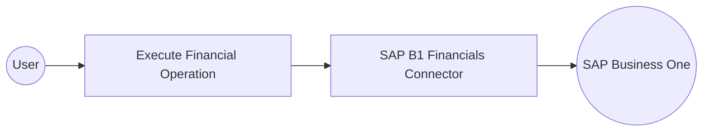

# Example

## What you'll build

Build a WSO2 Integrator automation that connects to SAP Business One via the `sap.businessone.financials` connector and calls a primary financial operation against a live SAP Business One service. The integration uses an Automation entry point that triggers the SAP Business One Financials connector's remote function and logs the returned financial data. The completed flow consists of an Automation trigger, the SAP B1 Financials remote function node, a Log node, and the Error Handler—all connected and visible on the WSO2 Integrator design canvas.

**Operations used:**
- **listJournalEntries** : Queries the JournalEntries collection from the SAP Business One Service Layer and returns a collection response containing the journal entry records.

## Architecture

## Prerequisites

- A running SAP Business One service accessible at a known URL (for example, `https://your-sap-b1-host/b1s/v1`).
- Valid SAP Business One credentials (username, password, and company database name) with sufficient permissions to call financial APIs.
- Network access from the WSO2 Integrator host to the SAP Business One service endpoint.

## Setting up the sap.businessone.financials integration

> **New to WSO2 Integrator?** Follow the [Create a New Integration](../../../../develop/create-integrations/create-a-new-integration.md) guide to set up your integration first, then return here to add the connector.

## Adding the sap.businessone.financials connector

### Step 1: Open the Add Connection palette

Select the **Add Connection** button (or the **+** icon next to the Connections section) in the left sidebar of the WSO2 Integrator low-code canvas to open the connector search palette.

### Step 2: Search for and select the sap.businessone.financials connector

1. In the search box of the connector palette, enter **`sap.businessone.financials`**.
2. Locate the **Financials** connector card (`ballerinax / sap.businessone.financials`) in the search results.
3. Select the connector card to open the Configure Financials connection form.

## Configuring the sap.businessone.financials connection

### Step 3: Bind connection parameters to configurable variables

For each field in the Configure Financials form, open the configurables panel, select **+ New Configurable**, enter a descriptive variable name and type, and select **Save** to auto-inject the configurable reference into the field.

- **Session** : the SAP Business One Service Layer session credentials record, with each field bound to its own configurable variable (company database name, login username, and login password).
- **Service Url** : the base URL of the target SAP Business One Service Layer endpoint.

### Step 4: Save the SAP Business One Financials connection

Select **Save Connection** to persist the connection. The `financialsClient` connector entry now appears in the Connections panel on the low-code canvas.

### Step 5: Set actual values for your configurables

In the left panel of WSO2 Integrator, select **Configurations** (listed at the bottom of the project tree, under Data Mappers) to open the Configurations panel. Set a value for each configurable:

- **sapServiceUrl** (string) : the full base URL of your SAP Business One Service Layer
- **sapCompanyDb** (string) : the name of the SAP Business One company database
- **sapUsername** (string) : your SAP Business One login username
- **sapPassword** (string) : your SAP Business One login password

## Configuring the SAP Business One Financials listJournalEntries operation

### Step 6: Add an Automation entry point

1. In the left sidebar, hover over **Entry Points** and select **Add Entry Point**.
2. Select **Automation** in the artifact selection panel.
3. Select **Create** in the dialog to accept the default settings and add the Automation trigger to the canvas.

### Step 7: Select the listJournalEntries operation and configure its parameters

1. Select the **+** (Add Step) button in the automation flow between the Start and Error Handler nodes to open the step-addition panel.
2. Under **Connections** in the node panel, select the **financialsClient** connection node to expand it and reveal all available operations.

3. Select **List Journal Entries** from the list of operations and fill in the operation fields:
- **Result** : the name of the local variable that stores the returned `JournalEntriesCollectionResponse`, set to `result`.
4. Select **Save** to add the step to the automation flow.

### Step 8: Log the List Journal Entries result

1. Select **Add Step** after the connector operation.
2. Expand **Logging** and select **Log Info**.
3. Switch **Msg** to **Expression** mode.
4. Enter `result.toJsonString()` to log the returned journal entries collection.
5. Select **Save** and return to the visual flow.

## Try it yourself

Try this sample in WSO2 Integration Platform.

[View source on GitHub](https://github.com/wso2/integration-samples/tree/main/connectors/sap_businessone_financials_connector_sample)

## More code examples

The SAP Business One connectors provide practical examples illustrating usage in various scenarios. Explore these
[examples](https://github.com/ballerina-platform/module-ballerinax-sap.businessone/tree/main/examples), covering
use cases like listing open sales orders, reporting inventory stock, and logging CRM activities.
