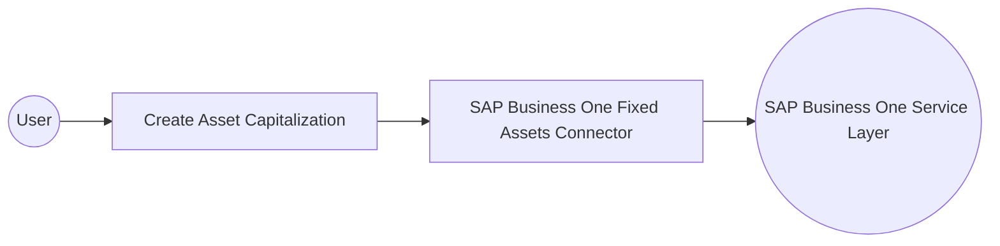

# Example

## What you'll build

This example shows how to connect to SAP Business One's Service Layer using the SAP Business One Fixed Assets connector to create a fixed asset capitalization document. The integration binds connection credentials to configurable variables and invokes the connector's primary write operation to capitalize a new asset.

**Operations used:**
- **Create Asset Capitalization** : creates a new asset capitalization document (`AssetDocument`) in SAP Business One.

## Architecture

## Prerequisites

- Valid SAP Business One Service Layer credentials (company database, username, and password).

## Setting up the SAP Business One Fixed Assets integration

> **New to WSO2 Integrator?** Follow the [Create a New Integration](../../../../develop/create-integrations/create-a-new-integration.md) guide to set up your integration first, then return here to add the connector.

## Adding the SAP Business One Fixed Assets connector

### Step 1: Open the connector palette

Select **Add Connection** in the **Connections** section of the sidebar to open the connector palette.

### Step 2: Search for and select the connector

1. Enter `fixedassets` in the search box.
2. Select the **Fixedassets** connector card to open its connection form.

## Configuring the SAP Business One Fixed Assets connection

### Step 3: Configure connection parameters and bind them to configurable variables

Bind each connection field to a new configurable variable using the helper panel's **Configurables** option.
- **Session** : SAP Business One Service Layer session credentials, composed of the company database, username, and password, each bound to its own configurable variable.
- **Service Url** : URL of the target SAP Business One Service Layer service, bound to a configurable variable.
- **Connection Name** : identifier used for the connection in the flow.

### Step 4: Save the connection

Select **Save** to persist the connection. The canvas returns to the integration design view, showing the new connection card next to the Automation entry point.

### Step 5: Set actual values for your configurables

1. Select **Configurations** in the left panel, at the bottom of the project tree under **Data Mappers**.
2. Set a value for each configurable listed below.

- **sapCompanyDb** (string) : SAP Business One company database identifier.
- **sapUsername** (string) : SAP Business One Service Layer login username.
- **sapPassword** (string) : SAP Business One Service Layer login password.
- **sapServiceUrl** (string) : URL of the target SAP Business One Service Layer service.

## Configuring the SAP Business One Fixed Assets Create Asset Capitalization operation

### Step 6: Add an Automation entry point

Add an **Automation** artifact to create the entry point with its default Start → Error Handler flow.

### Step 7: Expand the connection's available operations

1. Select the **+** icon between **Start** and **Error Handler**.
2. Select the **fixedassetsClient** connection under **Connections** to expand its list of operations.

### Step 8: Select the Create Asset Capitalization operation and configure its input fields

Select **Create Asset Capitalization**, then configure the payload fields listed below.
- **PostingDate** : posting date of the asset capitalization document.
- **DocumentDate** : document date of the asset capitalization document.
- **Remarks** : free-text remarks stored on the document.
- **Currency** : currency code used for the document.

Select **Save** to add the Create Asset Capitalization operation to the automation flow.

## Try it yourself

Try this sample in WSO2 Integration Platform.

[View source on GitHub](https://github.com/wso2/integration-samples/tree/main/integrator-default-profile/connectors/sap_businessone_fixedassets_connector_sample)

## More code examples

The SAP Business One connectors provide practical examples illustrating usage in various scenarios. Explore these
[examples](https://github.com/ballerina-platform/module-ballerinax-sap.businessone/tree/main/examples), covering
use cases like listing open sales orders, reporting inventory stock, and logging CRM activities.
