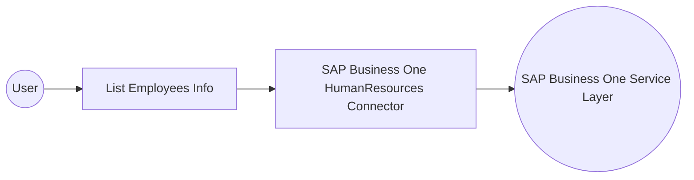

# Example

## What you'll build

This example demonstrates how to connect to the SAP Business One Service Layer and retrieve employee information using the SAP Business One Human Resources connector. The integration creates an automation that queries employee records and logs the result.

**Operations used:**
- **List Employees Info** : Retrieves the collection of employee records from the SAP Business One Service Layer.

## Architecture

## Prerequisites

- Access to an SAP Business One Service Layer endpoint.
- Valid SAP Business One credentials, including a company database identifier, username, and password.

## Setting up the SAP Business One Human Resources integration

> **New to WSO2 Integrator?** Follow the [Create a New Integration](../../../../develop/create-integrations/create-a-new-integration.md) guide to set up your integration first, then return here to add the connector.

## Adding the SAP Business One Human Resources connector

### Step 1: Open the connector palette
Select **Add Connection** in the Connections panel to open the connector palette, then search for and select the **HumanResources** connector.

## Configuring the SAP Business One Human Resources connection

### Step 2: Fill in the connection parameters
Enter the connection details, binding each field to a configurable variable so values can be supplied at runtime.
- **companyDb** : SAP Business One company database identifier.
- **username** : Username used to authenticate with the SAP Business One Service Layer.
- **password** : Password used to authenticate with the SAP Business One Service Layer.
- **serviceUrl** : Base URL of the SAP Business One Service Layer endpoint.
- **connectionName** : Name assigned to the generated connection instance.

### Step 3: Save the connection
Select **Save** to persist the connection and confirm it appears in the Connections panel.

### Step 4: Set actual values for your configurables
Select **Configurations** in the left panel, at the bottom of the project tree under Data Mappers, then enter a value for each configurable variable listed below.
- **sapCompanyDb** (string) : Enter the SAP Business One company database identifier.
- **sapUsername** (string) : Enter the username used to authenticate with the SAP Business One Service Layer.
- **sapPassword** (string) : Enter the password used to authenticate with the SAP Business One Service Layer.
- **sapServiceUrl** (string) : Enter the base URL of the SAP Business One Service Layer endpoint.

## Configuring the SAP Business One Human Resources List Employees Info operation

### Step 5: Add an automation entry point
Select **Add Artifact**, then select **Automation** to create a new automation. The automation canvas opens with a **Start** node, an **Error Handler** node, and an add-step node between them.

### Step 6: Select and configure the List Employees Info operation
Expand **Connections**, select the saved connection, then select **List Employees Info** to add the operation to the flow.

The operation requires no input parameters and stores its result in a response variable of type `humanresources:EmployeesInfoCollectionResponse`.

Rename the response variable to `employeesInfo`, then select **Save** to add the operation node to the flow.

### Step 7: Log the List Employees Info result

1. Select **Add Step** after the connector operation.
2. Expand **Logging** and select **Log Info**.
3. Switch **Msg** to **Expression** mode.
4. Enter `employeesInfo.toJsonString()` to log the returned employee collection.
5. Select **Save** and return to the visual flow.

## Try it yourself

Try this sample in WSO2 Integration Platform.

[View source on GitHub](https://github.com/wso2/integration-samples/tree/main/connectors/sap_businessone_humanresources_connector_sample)

## More code examples

The SAP Business One connectors provide practical examples illustrating usage in various scenarios. Explore these
[examples](https://github.com/ballerina-platform/module-ballerinax-sap.businessone/tree/main/examples), covering
use cases like listing open sales orders, reporting inventory stock, and logging CRM activities.
