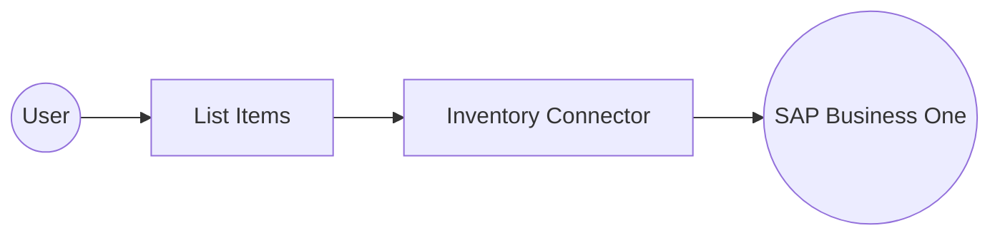

# Example

## What you'll build

Build an automation that retrieves inventory items from SAP Business One. The flow logs the returned collection for monitoring or downstream processing.

**Operations used:**

- **List Items** : Retrieves the Items collection from SAP Business One.

## Architecture

## Prerequisites

- An SAP Business One installation with the Service Layer component enabled.
- A company database name, user name, and password with permission to read inventory items.

## Setting up the Inventory integration

> **New to WSO2 Integrator?** Follow the [Create a New Integration](../../../../develop/create-integrations/create-a-new-integration.md) guide to set up your integration first, then return here to add the connector.

## Adding the Inventory connector

### Step 1: Open the connector palette

Select **Add Connection** in the **Connections** section.

### Step 2: Select the Inventory connector

1. Enter `sap.businessone.inventory` in the search field.
2. Select the **Inventory** connector card.

## Configuring the Inventory connection

### Step 3: Bind the connection parameters to configurable variables

Bind the SAP Business One session fields to configurable variables.

- **Session** : Supplies the company database, user name, and password for a Service Layer session.

### Step 4: Save the connection

Select **Save Connection** and verify that the connection appears in the **Connections** section.

### Step 5: Set actual values for your configurables

1. Select **Configurations** at the bottom of the project tree under **Data Mappers**.
2. Enter a value for each configurable listed below before you run the integration.

- **companyDb** (`string`) : Company database name for the SAP Business One session.
- **userName** (`string`) : User name with permission to read inventory items.
- **password** (`string`) : Password for the SAP Business One user.

## Configuring the Inventory List Items operation

### Step 6: Add an automation entry point

1. Select **Add Entry Point** next to **Entry Points**.
2. Select **Automation**.
3. Select **Create** to accept the settings.

### Step 7: Expand the connection and configure the List Items operation

1. Select **Add Step** in the automation flow.
2. Expand **inventoryClient** to display its operations.

3. Select **List Items**.
4. Enter `inventoryItems` in **Result**.

- **Result** : Names the variable that stores the returned items collection.

5. Select **Save**.

### Step 8: Log the List Items result

1. Select **Add Step** after the connector operation.
2. Expand **Logging** and select **Log Info**.
3. Switch **Msg** to **Expression** mode.
4. Enter `inventoryItems.toJsonString()` to log the returned inventory collection.
5. Select **Save** and return to the visual flow.

## Try it yourself

Try this sample in WSO2 Integration Platform.

[View source on GitHub](https://github.com/wso2/integration-samples/tree/main/integrator-default-profile/connectors/sap_businessone_inventory_connector_sample)

## More code examples

The SAP Business One connectors provide practical examples illustrating usage in various scenarios. Explore these
[examples](https://github.com/ballerina-platform/module-ballerinax-sap.businessone/tree/main/examples), covering
use cases like listing open sales orders, reporting inventory stock, and logging CRM activities.
