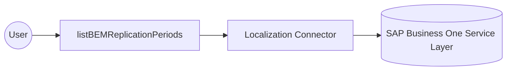

# Example

## What you'll build

Build an automation that connects to SAP Business One through the Service Layer and queries BEM replication periods.
The connection uses configurable credentials, and the operation stores its collection response in a result variable.

**Operations used:**
- **listBEMReplicationPeriods** : Query the BEMReplicationPeriods collection.

## Architecture

## Prerequisites

- An SAP Business One installation with the Service Layer enabled.
- A company database, user name, and password with access to the Service Layer.

## Setting up the Localization integration

> **New to WSO2 Integrator?** Follow the [Create a New Integration](../../../../develop/create-integrations/create-a-new-integration.md) guide to set up your integration first, then return here to add the connector.

## Adding the Localization connector

### Step 1: Open the connector palette

Select **Add Connection** in the **Connections** section.

### Step 2: Select the Localization connector

1. Enter `ballerinax/sap.businessone.localization` in the search field.
2. Select the **Localization** connector card.

## Configuring the Localization connection

### Step 3: Bind the connection parameters to configurable variables

Bind every required connection field to a configurable variable.

- **Session** : Bind the SAP Business One session settings to configurable variables.
- **Connection Name** : Enter `localizationClient` as the connection name.

### Step 4: Save the connection

Select **Save** and verify that the connection appears in the **Connections** section.

### Step 5: Set actual values for your configurables

1. Select **Configurations** at the bottom of the project tree under **Data Mappers**.
2. Enter a value for each configurable listed below before you run the integration.

- **companyDb** (`string`) : Enter the SAP Business One company database name.
- **userName** (`string`) : Enter the SAP Business One user name.
- **password** (`string`) : Enter the SAP Business One password.

## Configuring the Localization listBEMReplicationPeriods operation

### Step 6: Add an automation entry point

1. Select **Add Entry Point** next to **Entry Points**.
2. Select **Automation**.
3. Select **Create** to accept the settings.

### Step 7: Expand the connection and configure the listBEMReplicationPeriods operation

1. Select **Add Step** in the automation flow.
2. Expand **localizationClient** to display its operations.

3. Select **List Bem Replication Periods**.
4. Review the generated result variable for the returned collection.

- **Result** : Keep the generated result variable for the `BEMReplicationPeriodsCollectionResponse` value.

5. Select **Save**.

## Try it yourself

Try this sample in WSO2 Integration Platform.

[View source on GitHub](https://github.com/wso2/integration-samples/tree/main/integrator-default-profile/connectors/sap_businessone_localization_connector_sample)

## More code examples

The SAP Business One connectors provide practical examples illustrating usage in various scenarios. Explore these
[examples](https://github.com/ballerina-platform/module-ballerinax-sap.businessone/tree/main/examples), covering
use cases like listing open sales orders, reporting inventory stock, and logging CRM activities.
