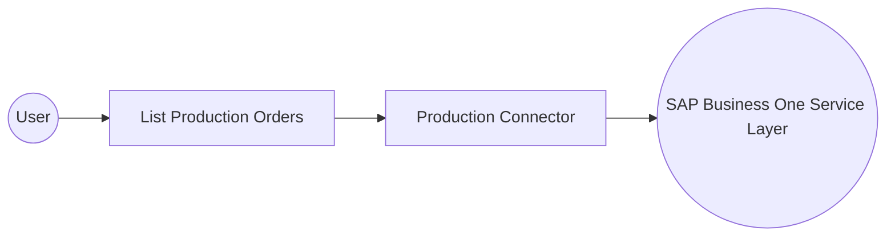

# Example

## What you'll build

Build an automation that retrieves production orders from SAP Business One through the Production connector. The automation logs the returned collection for downstream review.

**Operations used:**

- **List Production Orders** : Retrieves the ProductionOrders collection from SAP Business One.

## Architecture

## Prerequisites

- An SAP Business One company database with Service Layer access
- The SAP Business One Service Layer URL
- Credentials for a user who can read production orders

## Setting up the Production integration

> **New to WSO2 Integrator?** Follow the [Create a New Integration](../../../../develop/create-integrations/create-a-new-integration.md) guide to set up your integration first, then return here to add the connector.

## Adding the Production connector

### Step 1: Open the connector palette

Select **Add Connection** in the **Connections** section.

### Step 2: Select the Production connector

1. Enter `sap.businessone.production` in the search field.
2. Select the **Production** connector card.

## Configuring the Production connection

### Step 3: Bind the connection parameters to configurable variables

Bind the required connection fields to configurable variables, and set the connection details.

- **Session** : Supplies the company database, username, and password through required configurable variables.
- **Config** : Supplies optional client settings for the connection.
- **Service Url** : Supplies the Service Layer endpoint through a required configurable variable.
- **Connection Name** : Identifies the saved connection in the automation flow.

### Step 4: Save the connection

Select **Save** and verify that the connection appears in the **Connections** section.

### Step 5: Set actual values for your configurables

1. Select **Configurations** at the bottom of the project tree under **Data Mappers**.
2. Enter a value for each configurable listed below before you run the integration.

- **serviceUrl** (`string`) : Service Layer endpoint for the SAP Business One environment.
- **companyDb** (`string`) : SAP Business One company database name.
- **userName** (`string`) : Username for the SAP Business One session.
- **password** (`string`) : Password for the SAP Business One session.

## Configuring the Production List Production Orders operation

### Step 6: Add an automation entry point

1. Select **Add Entry Point** next to **Entry Points**.
2. Select **Automation**.
3. Select **Create** to accept the settings.

### Step 7: Expand the connection and configure the List Production Orders operation

1. Select **Add Step** in the automation flow.
2. Expand **sapProductionClient** to display its operations.

3. Select **List Production Orders**. This operation has no required request parameters.
4. Review the generated result settings.

- **Result** : Names the result variable used by the following log action.

5. Select **Save**.

### Step 8: Log the List Production Orders result

1. Select **Add Step** after the connector operation.
2. Expand **Logging**.
3. Select **Log Info**.
4. Select **Expression** for **Msg**.
5. Enter `productionOrders.toJsonString()`.
6. Select **Save** and return to the visual flow.

## Try it yourself

Try this sample in WSO2 Integration Platform.

[View source on GitHub](https://github.com/wso2/integration-samples/tree/main/integrator-default-profile/connectors/sap_businessone_production_connector_sample)

## More code examples

The SAP Business One connectors provide practical examples illustrating usage in various scenarios. Explore these
[examples](https://github.com/ballerina-platform/module-ballerinax-sap.businessone/tree/main/examples), covering
use cases like listing open sales orders, reporting inventory stock, and logging CRM activities.
