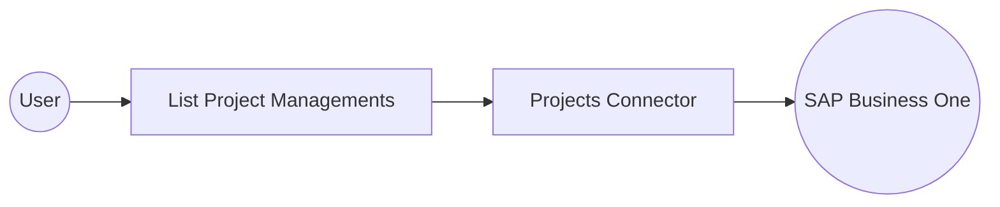

# Example

## What you'll build

Build an automation that retrieves project management records from SAP Business One. The integration logs the returned collection for review.

**Operations used:**

- **List Project Managements** : Retrieves the project management collection.

## Architecture

## Prerequisites

- An SAP Business One installation with the Service Layer enabled.
- The Service Layer endpoint, company database, username, and password.

## Setting up the Projects integration

> **New to WSO2 Integrator?** Follow the [Create a New Integration](../../../../develop/create-integrations/create-a-new-integration.md) guide to set up your integration first, then return here to add the connector.

## Adding the Projects connector

### Step 1: Open the connector palette

Select **Add Connection** in the **Connections** section.

### Step 2: Select the Projects connector

1. Enter `sap.businessone.projects` in the search field.
2. Select the **Projects** connector card.

## Configuring the Projects connection

### Step 3: Bind the session fields to configurable variables

1. Create `companyDb`, `username`, and `password` as `string` configurable variables.
2. Switch **Session** to **Expression**.
3. Bind each session field to its matching configurable variable.

- **Session** : Provides the company database, username, and password for the Service Layer session.

### Step 4: Save the connection

Select **Save Connection** and verify that `projectsClient` appears under **Connections**.

### Step 5: Set actual values for your configurables

1. Select **Configurations** at the bottom of the project tree under **Data Mappers**.
2. Enter a value for each configurable before you run the integration.

- **companyDb** (`string`) : Specifies the SAP Business One company database.
- **username** (`string`) : Specifies the SAP Business One username.
- **password** (`string`) : Specifies the SAP Business One password.

## Configuring the Projects List Project Managements operation

### Step 6: Add an automation entry point

1. Select **Add Entry Point** next to **Entry Points**.
2. Select **Automation**.
3. Select **Create**.

### Step 7: Add and configure List Project Managements

1. Select the **+** node between **Start** and **Error Handler**.
2. Expand **projectsClient** to display its operations.

3. Select **List Project Managements**.
4. Enter `projectManagements` in **Result**.

- **Result** : Names the variable that stores the returned collection.
- **Result T&#121;pe** : Uses the generated response structure for project management records.

5. Select **Save**.

### Step 8: Log the List Project Managements result

1. Add **Log Info** after **List Project Managements**.
2. Log the returned `projectManagements` value.
3. Return to the automation flow.

## Try it yourself

Try this sample in WSO2 Integration Platform.

[View source on GitHub](https://github.com/wso2/integration-samples/tree/main/integrator-default-profile/connectors/sap_businessone_projects_connector_sample)

## More code examples

The SAP Business One connectors provide practical examples illustrating usage in various scenarios. Explore these
[examples](https://github.com/ballerina-platform/module-ballerinax-sap.businessone/tree/main/examples), covering
use cases like listing open sales orders, reporting inventory stock, and logging CRM activities.
