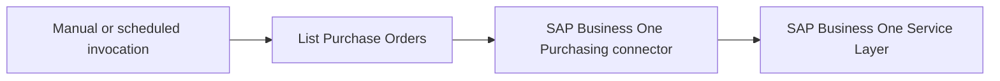

# Example

## What you'll build

Build an automation that connects to SAP Business One and retrieves the available purchase orders. The flow uses a saved Purchasing connection and exposes the response as a result variable.

**Operations used:**

- List Purchase Orders

## Architecture

## Prerequisites

- An SAP Business One installation with the Service Layer enabled.
- The SAP Business One company database name, user name, and password.
- The Service Layer endpoint for your SAP Business One environment.

## Setting up the Purchasing integration

> **New to WSO2 Integrator?** Follow the [Create a New Integration](../../../../develop/create-integrations/create-a-new-integration.md) guide to set up your integration first, then return here to add the connector.

## Adding the Purchasing connector

### Step 1: Open the connector palette

Open **Connections**, select **Add Connection**, and search for the SAP Business One Purchasing package.

### Step 2: Select the Purchasing connector

Select **Purchasing** to open its connection configuration form.

## Configuring the Purchasing connection

### Step 3: Configure the connection

Enter the connection values as configurable variables, and keep credential values outside the integration source.

- **Session** : Bind the company database, user name, and password configurable variables.
- **Config** : Keep the default connector configuration unless your environment requires advanced settings.
- **Service Url** : Bind the configurable variable containing the SAP Business One Service Layer endpoint.
- **Connection Name** : Enter `purchasingOrdersClient`.

### Step 4: Save and review the connection

Save the connection, then expand **Connections** and confirm that **purchasingOrdersClient** appears. Review **Configurations** to verify that the generated configurable entries don't contain credential values.

## Configuring the Purchasing List Purchase Orders operation

### Step 5: Create an automation entry point

Add an **Automation** entry point and select **Create** to open its flow editor.

### Step 6: Expand the saved connection

Add a node after **Start**, then expand **purchasingOrdersClient** in the node panel to view its available operations.

### Step 7: Configure List Purchase Orders

Select **List Purchase Orders**. Keep the generated result variable and result type, because this operation has no required input parameters.

- **Result** : Stores the purchase orders collection response.
- **Result Type** : Uses the generated Purchasing response type.

### Step 8: Save the completed flow

Save the operation and confirm that **purchasing : listPurchaseOrders** appears between **Start** and the error handler.

## Try it yourself

Try this sample in WSO2 Integration Platform.

[View source on GitHub](https://github.com/wso2/integration-samples/tree/main/integrator-default-profile/connectors/sap_businessone_purchasing_connector_sample)

## More code examples

The SAP Business One connectors provide practical examples illustrating usage in various scenarios. Explore these
[examples](https://github.com/ballerina-platform/module-ballerinax-sap.businessone/tree/main/examples), covering
use cases like listing open sales orders, reporting inventory stock, and logging CRM activities.
