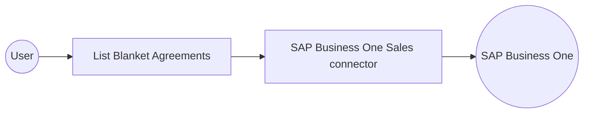

# Example

## What you'll build

Build an automation that retrieves blanket agreements from SAP Business One Sales. The automation stores the response in `blanketAgreements` and writes it to the integration log.

**Operations used:**
- **List Blanket Agreements** : Retrieves the BlanketAgreements collection

## Architecture

## Prerequisites

- An SAP Business One account with access to the Service Layer
- Your SAP Business One company database name, user name, and password

## Setting up the SAP Business One Sales integration

> **New to WSO2 Integrator?** Follow the [Create a New Integration](../../../../develop/create-integrations/create-a-new-integration.md) guide to set up your integration first, then return here to add the connector.

## Adding the SAP Business One Sales connector

### Step 1: Open the connector palette

Select **Add Connection** in the **Connections** section.

### Step 2: Select the SAP Business One Sales connector

1. Enter `sap.businessone.sales` in the search field.
2. Select the **SAP Business One Sales** connector card.

## Configuring the SAP Business One Sales connection

### Step 3: Bind the connection parameters to configurable variables

Bind the required SAP Business One credentials to configurable variables.

- **Session** : Bind the company database, user name, and password variables in the session record

### Step 4: Save the connection

Select **Save** and verify that the connection appears in the **Connections** section.

### Step 5: Set actual values for your configurables

1. Select **Configurations** at the bottom of the project tree under **Data Mappers**.
2. Enter a value for each configurable listed below before you run the integration.

- **companyDb** (`string`) : SAP Business One company database name
- **username** (`string`) : SAP Business One user name
- **password** (`string`) : SAP Business One password

## Configuring the SAP Business One Sales List Blanket Agreements operation

### Step 6: Add an automation entry point

1. Select **Add Entry Point** next to **Entry Points**.
2. Select **Automation**.
3. Select **Create** to accept the settings.

### Step 7: Expand the connection and configure the List Blanket Agreements operation

1. Select **Add Step** in the automation flow.
2. Expand **salesClient** to display its operations.

Select **List Blanket Agreements** and enter `blanketAgreements` as the result variable name.

- **Result** : Name the response variable that receives the BlanketAgreements collection

Select **Save**.

### Step 8: Log the List Blanket Agreements result

Add a log action for `blanketAgreements`, then return to the visual flow.

## Try it yourself

Try this sample in WSO2 Integration Platform.

[View source on GitHub](https://github.com/wso2/integration-samples/tree/main/integrator-default-profile/connectors/sap_businessone_sales_connector_sample)

## More code examples

The SAP Business One connectors provide practical examples illustrating usage in various scenarios. Explore these
[examples](https://github.com/ballerina-platform/module-ballerinax-sap.businessone/tree/main/examples), covering
use cases like listing open sales orders, reporting inventory stock, and logging CRM activities.
