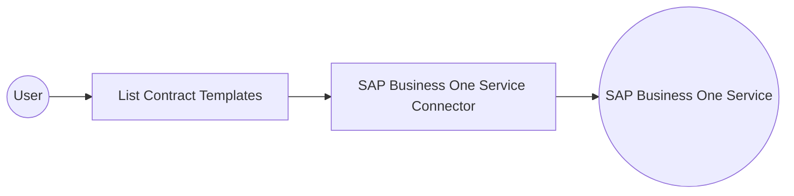

# Example

## What you'll build

This example demonstrates how to use the SAP Business One Service connector in WSO2 Integrator to list contract templates. The integration queries the templates from SAP Business One Service and stores the response in a variable.

**Operations used:**
- **listContractTemplates** : Queries the ContractTemplates collection from SAP Business One.

## Architecture

## Prerequisites

- An active SAP Business One Service Layer instance

## Setting up the SAP Business One Service integration

> **New to WSO2 Integrator?** Follow the [Create a New Integration](../../../../develop/create-integrations/create-a-new-integration.md) guide to set up your integration first, then return here to add the connector.

## Adding the SAP Business One Service connector

### Step 1: Open the connector palette

Select **Add Connection** in the **Connections** section.

### Step 2: Select the SAP Business One Service connector

1. Enter `sap.businessone.service` in the search field.
2. Select the **SAP Business One Service** connector card.

## Configuring the SAP Business One Service connection

### Step 3: Bind the connection parameters to configurable variables

Bind every required connection field to a configurable variable.

- **Service URL** : The base URL of the SAP Business One Service Layer.
- **Company DB** : The company database name.
- **Username** : The username for authentication.
- **Password** : The password for authentication.

### Step 4: Save the connection

Select **Save** and verify that the connection appears in the **Connections** section.

### Step 5: Set actual values for your configurables

1. Select **Configurations** under **Data Mappers** in the project tree.
2. Enter a value for each configurable listed below before you run the integration.

- **serviceUrl** (`string`) : The base URL of the SAP Business One Service Layer.
- **companyDb** (`string`) : The company database name.
- **username** (`string`) : The username for authentication.
- **password** (`string`) : The password for authentication.

## Configuring the SAP Business One Service List Contract Templates operation

### Step 6: Add an automation entry point

1. Select **Add Entry Point** next to **Entry Points**.
2. Select **Automation**.
3. Select **Create** to accept the settings.

### Step 7: Expand the connection and configure the List Contract Templates operation

1. Select **Add Step** in the automation flow.
2. Expand **serviceClient** to display its operations.

3. Select **List Contract Templates**. This operation does not require any request parameters.

4. Select **Save**.

### Step 8: View the completed integration flow

Verify that the List Contract Templates operation is added to the automation flow.

## Try it yourself

Try this sample in WSO2 Integration Platform.

[View source on GitHub](https://github.com/wso2/integration-samples/tree/main/integrator-default-profile/connectors/sap_businessone_service_connector_sample)

## More code examples

The SAP Business One connectors provide practical examples illustrating usage in various scenarios. Explore these
[examples](https://github.com/ballerina-platform/module-ballerinax-sap.businessone/tree/main/examples), covering
use cases like listing open sales orders, reporting inventory stock, and logging CRM activities.
