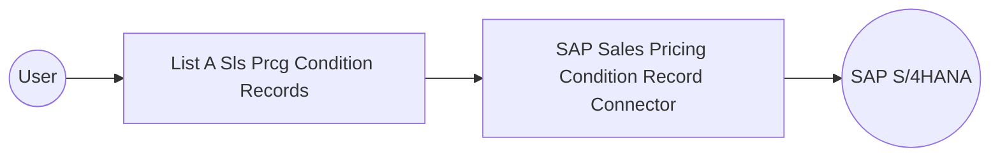

# Example

## What you'll build

Build an automation that connects to an SAP S/4HANA system and lists pricing condition records using the Condition Record for Pricing in Sales API. The automation logs the retrieved records as a JSON string for inspection.

**Operations used:**
- **List A Sls Prcg Condition Records** : Reads all condition records in the system.

## Architecture

## Prerequisites

- Access to an SAP S/4HANA system with the Condition Record for Pricing in Sales API enabled
- SAP hostname, username, and password

## Setting up the SAP Sales Pricing Condition Record integration

> **New to WSO2 Integrator?** Follow the [Create a New Integration](../../../../develop/create-integrations/create-a-new-integration.md) guide to set up your integration first, then return here to add the connector.

## Adding the SAP Sales Pricing Condition Record connector

### Step 1: Open the connector palette

Select **Add Connection** in the **Connections** section.

### Step 2: Select the SAP Sales Pricing Condition Record connector

1. Enter `sap.s4hana.api_slspricingconditionrecord_srv` in the search field.
2. Select the **Api_slspricingconditionrecord_srv** connector card.

## Configuring the SAP Sales Pricing Condition Record connection

### Step 3: Bind the connection parameters to configurable variables

Bind every required connection field to a configurable variable.

- **Config** : Authentication configuration for the connector; bind the `username` and `password` fields to configurable variables.
- **Hostname** : The SAP S/4HANA server hostname; bind to a configurable variable.

### Step 4: Save the connection

Select **Save** and verify that the connection appears in the **Connections** section.

### Step 5: Set actual values for your configurables

1. Select **Configurations** at the bottom of the project tree under **Data Mappers**.
2. Enter a value for each configurable listed below before you run the integration.

- **sapHostname** (`string`) : The SAP S/4HANA server hostname.
- **username** (`string`) : The username for SAP access.
- **password** (`string`) : The password for SAP access.

## Configuring the SAP Sales Pricing Condition Record List A Sls Prcg Condition Records operation

### Step 6: Add an automation entry point

1. Select **Add Entry Point** next to **Entry Points**.
2. Select **Automation**.
3. Select **Create** to accept the settings.

### Step 7: Expand the connection and configure the List A Sls Prcg Condition Records operation

1. Select **Add Step** in the automation flow.
2. Expand **apiSlspricingconditionrecordSrvClient** to display its operations.

3. Select **List A Sls Prcg Condition Records**. This operation has no required parameters.

4. Select **Save**.

### Step 8: Log the List A Sls Prcg Condition Records result

Add a log action for the returned value, then return to the visual flow.

## Try it yourself

Try this sample in WSO2 Integration Platform.

[View source on GitHub](https://github.com/wso2/integration-samples/tree/main/integrator-default-profile/connectors/sap.s4hana.api_slspricingconditionrecord_srv_connector_sample)

## More code examples

The S/4 HANA Sales and Distribution connectors provide practical examples illustrating usage in various
scenarios. Explore
these [examples](https://github.com/ballerina-platform/module-ballerinax-sap.s4hana.sales/tree/main/examples), covering
use cases like accessing S/4HANA Sales Order (A2X) API.

1. [Salesforce to S/4HANA Integration](https://github.com/ballerina-platform/module-ballerinax-sap.s4hana.sales/tree/main/examples/salesforce-to-sap) -
   Demonstrates leveraging the `sap.s4hana.api_sales_order_srv:Client` connector for S/4HANA API interactions. It
   specifically showcases how to respond to a Salesforce Opportunity Close Event by automatically generating a Sales
   Order in the S/4HANA SD module.

2. [Shopify to S/4HANA Integration](https://github.com/ballerina-platform/module-ballerinax-sap.s4hana.sales/tree/main/examples/shopify-to-sap) -
   Details the integration process between [Shopify](https://admin.shopify.com/), a leading e-commerce platform,
   and [SAP S/4HANA](https://www.sap.com/products/erp/s4hana.html), a comprehensive ERP system. The objective is to
   automate SAP sales order creation for new orders placed on Shopify, enhancing efficiency and accuracy in order
   management.
