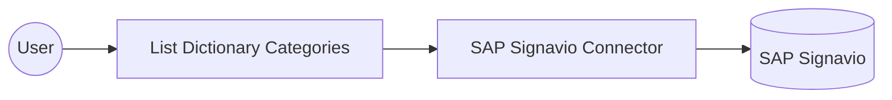

# Example

## What you'll build

This example builds an automation that connects to SAP Signavio and lists the dictionary categories defined in your workspace. The automation calls the **List Dictionary Categories** operation and logs the result.

**Operations used:**
- **List Dictionary Categories** : Retrieves a list of your workspace's dictionary categories.

## Architecture

## Prerequisites

- An SAP Signavio account with a user name and password. See the connector's [Setup Guide](setup-guide.md).

## Setting up the SAP Signavio integration

> **New to WSO2 Integrator?** Follow the [Create a New Integration](../../../../develop/create-integrations/create-a-new-integration.md) guide to set up your integration first, then return here to add the connector.

## Adding the SAP Signavio connector

### Step 1: Open the connector palette

Select **Add Connection** in the **Connections** section.

### Step 2: Select the SAP Signavio connector

Enter "signavio" in the search box to filter the connector list, then select the **Signavio** connector card (`ballerinax/sap.signavio`) to open its connection configuration form.

## Configuring the SAP Signavio connection

### Step 3: Bind the connection parameters to configurable variables

Bind the required connection fields to configurable variables.

- **Username** : The account's user name (typically an email address).
- **Password** : The account's password.

### Step 4: Save the connection

Select **Save** and verify that the connection appears in the **Connections** section.

## Configuring the SAP Signavio List Dictionary Categories operation

### Step 5: Add an automation entry point

1. In the left panel under **Entry Points**, select **+** (**Add Entry Point**).
2. Under **Automation**, select **Automation**.
3. In the **Create New Automation** dialog, accept the default settings and select **Create**.

The canvas switches to the Automation flow view, showing a Start node, an Error Handler node, and an End node.

### Step 6: Set actual values for your configurables

1. Select **Configurations** at the bottom of the project tree under **Data Mappers**.
2. Enter a value for each configurable listed below before you run the integration.

- **username** (`string`) : Your SAP Signavio account's user name.
- **password** (`string`) : Your SAP Signavio account's password.

### Step 7: Select the List Dictionary Categories operation

1. In the automation flow body on the canvas, select the **+** (Add Step) button between the Start and Error Handler nodes to open the step-addition panel.
2. Under **Connections** in the step panel, select the **signavioClient** connection node to expand it and reveal all available SAP Signavio API operations.

3. Select **List Dictionary Categories** from the list. This operation has no required parameters, so only the result variable needs a name.

- **Result** : The name of the variable that holds the returned dictionary categories.

4. Select **Save** to add the SAP Signavio operation step to the automation flow.

### Step 8: Log the List Dictionary Categories result

Add a log action for the returned value, then return to the visual flow.

## Try it yourself

Try this sample in WSO2 Integration Platform.

[View source on GitHub](https://github.com/wso2/integration-samples/tree/main/integrator-default-profile/connectors/sap.signavio_connector_sample)

## More code examples

The `SAP Signavio` connector offers practical examples illustrating its use in various scenarios.
Explore these [examples](https://github.com/ballerina-platform/module-ballerinax-sap.signavio/tree/main/examples/), covering the following use cases:

1. [Process model export](https://github.com/ballerina-platform/module-ballerinax-sap.signavio/tree/main/examples/process-model-export): Browses the workspace folders and exports a process model as diagram JSON and BPMN 2.0 XML.
2. [Dictionary entry management](https://github.com/ballerina-platform/module-ballerinax-sap.signavio/tree/main/examples/dictionary-entry-management): Creates a dictionary entry, lists the entries of its category, and retrieves the entry's details.
3. [Business process extraction](https://github.com/ballerina-platform/module-ballerinax-sap.signavio/tree/main/examples/business-process-extraction): Signs in to a Process Manager workspace and collects the Business Process Level 2 and Level 3 models for a downstream Ardoq mapping step.
