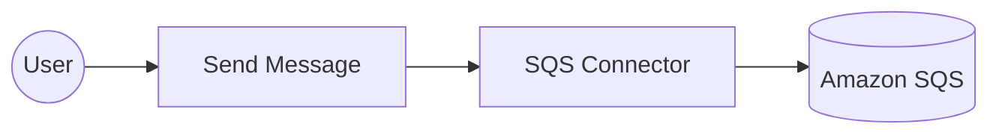

# Example

## What you'll build

This example builds an automation that delivers a message to an Amazon SQS queue. The automation runs on demand, sends one message through the SQS connector, and logs the response that Amazon SQS returns. Credentials and the target queue URL stay in configurable variables, so the integration holds no sensitive values.

**Operations used:**
- **Send Message** : Delivers a message to the specified SQS queue.

## Architecture

## Prerequisites

- An AWS account with an IAM user that's allowed to send messages to Amazon SQS.
- An access key ID and a secret access key for that IAM user.
- An Amazon SQS queue, along with its queue URL and region.

## Setting up the SQS integration

> **New to WSO2 Integrator?** Follow the [Create a New Integration](../../../../develop/create-integrations/create-a-new-integration.md) guide to set up your integration first, then return here to add the connector.

## Adding the SQS connector

### Step 1: Open the connector palette

Select **Add Connection** in the **Connections** section.

### Step 2: Select the SQS connector

1. Enter `aws.sqs` in the search field.
2. Select the **SQS** connector card.

> **Note:** Two cards match the search. Select **SQS** rather than **SQS Caller**, which belongs to the queue listener.

## Configuring the SQS connection

### Step 3: Bind the connection parameters to configurable variables

Bind each required connection field to a configurable variable so that the integration stores no credential. Keep the default authentication style, which uses a static access key pair, and keep the default connection name **sqsClient**.

- **Auth** : Authentication details that identify the caller to AWS
- **Region** : AWS region that hosts the queue

### Step 4: Save the connection

Select **Save Connection** and verify that the connection appears in the **Connections** section.

### Step 5: Set actual values for your configurables

1. Select **Configurations** at the bottom of the project tree under **Data Mappers**.
2. Enter a value for each configurable variable listed below before you run the integration.

- **region** (`string`) : AWS region that hosts the queue, such as `us-east-1`
- **accessKeyId** (`string`) : Access key ID of the IAM user
- **secretAccessKey** (`string`) : Secret access key of the IAM user

## Configuring the SQS Send Message operation

### Step 6: Add an automation entry point

1. Select **Add Entry Point** next to **Entry Points**.
2. Select **Automation**.
3. Select **Create** to accept the settings.

### Step 7: Expand the connection and configure the Send Message operation

1. Select **+** between **Start** and **Error Handler** in the automation flow.
2. Expand **sqsClient** to display its operations.

3. Select **Send Message** and enter its required values.

- **Queue Url** : Queue that receives the message, bound to a configurable variable
- **Message Body** : Message text to deliver, up to `256` KiB
- **Result** : Name of the variable that holds the response from Amazon SQS

4. Select **Save**.

### Step 8: Log the Send Message result

1. Select **+** below the **Send Message** node.
2. Expand **Logging** and select **Log Info**.
3. Set **Msg** to the operation result, then select **Save**.

## Try it yourself

Try this sample in WSO2 Integration Platform.

[View source on GitHub](https://github.com/wso2/integration-samples/tree/main/integrator-default-profile/connectors/aws.sqs_connector_sample)

## More code examples

The `ballerinax/aws.sqs` connector provides practical examples illustrating usage in various scenarios. Explore these [examples](https://github.com/ballerina-platform/module-ballerinax-aws.sqs/tree/master/examples):

1. [**Basic Queue Consumer**](https://github.com/ballerina-platform/module-ballerinax-aws.sqs/tree/master/examples/basic-queue-consumer) – Demonstrates creating a standard SQS queue, sending messages, and consuming them using a Ballerina listener.
2. [**Basic Queue Operations**](https://github.com/ballerina-platform/module-ballerinax-aws.sqs/tree/master/examples/basic-queue-operations) – Shows how to create a queue, send, receive, and delete messages, and delete the queue.
3. [**Advanced Messaging Features**](https://github.com/ballerina-platform/module-ballerinax-aws.sqs/tree/master/examples/advanced-messaging-features) – Demonstrates advanced messaging features such as message attributes, batch sending, and custom queue attributes.
4. [**FIFO Queue**](https://github.com/ballerina-platform/module-ballerinax-aws.sqs/tree/master/examples/fifo-queue) – Shows how to work with FIFO queues, including sending messages with different `messageGroupId`s and grouping received messages.
