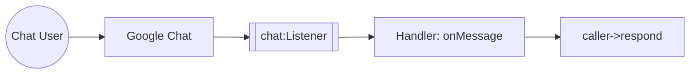

import ThemedImage from '@theme/ThemedImage';
import useBaseUrl from '@docusaurus/useBaseUrl';

# Example

## Google Chat Trigger Example

### What you'll build

A minimal Google Chat app that replies to every message with the same text. Google Chat delivers interaction events over HTTP; the `chat:Listener` verifies the Google-signed bearer token on each request before dispatching to `onMessage`, which replies via the injected `chat:MessageCaller`.

### Architecture



### Prerequisites

- A GCP project with the Google Chat API enabled and a Chat app configured. See the [Setup Guide](setup-guide.md).
- A public HTTPS URL for local development, for example using [ngrok](https://ngrok.com)

### Setting up the Google Chat integration

> **New to WSO2 Integrator?** Follow the [Create a New Integration](../../../../develop/create-integrations/create-a-new-integration.md) guide to set up your integration first, then return here to add the trigger.

### Adding the Google Chat trigger

Add a Google Chat event integration and implement the listener and service as described in the [Google Chat event integration guide](../../../../develop/integration-artifacts/event/google-chat.md). WSO2 Integrator renders the listener and service on the design canvas, with all available handlers listed under **Event Handlers**.

<ThemedImage
    alt="WSO2 Integrator design canvas showing the chatListener connected to ChatService with onMessage and onAddedToSpace handlers"
    sources={{
        light: useBaseUrl('/img/connectors/catalog/communication/google-chat/integration-overview.png'),
        dark: useBaseUrl('/img/connectors/catalog/communication/google-chat/integration-overview.png'),
    }}
/>

Select **chat:ChatService** in the design canvas to open the Service Designer, which lists every pre-registered event handler bound to the `chatListener`.

<ThemedImage
    alt="Google Chat Service Designer listing onMessage, onAddedToSpace, onRemovedFromSpace, and onCardClicked handlers"
    sources={{
        light: useBaseUrl('/img/connectors/catalog/communication/google-chat/service-designer.png'),
        dark: useBaseUrl('/img/connectors/catalog/communication/google-chat/service-designer.png'),
    }}
/>

### Handling Google Chat events

Select the **onMessage** row to open its flow canvas, then declare a variable for the message text and respond via the injected caller:

```ballerina
remote function onMessage(chat:MessageEvent event, chat:MessageCaller caller) returns error? {
    string text = event.message.text ?: "";
    log:printInfo("Google Chat message received", text = text);
    check caller->respond({text: "Echo: " + text});
}
```

### Running the integration

Run the integration from WSO2 Integrator, then message your Chat app from Google Chat. Google Chat delivers the event to your listener, which invokes `onMessage`, logs the message, and replies with the echoed text. Verify both the log entry and the reply in the chat.

## What's next

- [Action Reference](actions.md): manage spaces, messages, and members using the `Client`.
- [Trigger Reference](triggers.md): full listener configuration and service callback reference.
- [Setup Guide](setup-guide.md): create a GCP project and configure the Chat app.
