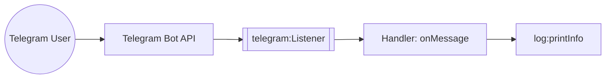

import ThemedImage from '@theme/ThemedImage';
import useBaseUrl from '@docusaurus/useBaseUrl';

# Example

## Telegram Trigger Example

### What you'll build

This integration reacts to incoming Telegram messages. When a user sends a message to your bot, the `telegram:Listener` receives the webhook update and routes it to the `onMessage` handler in your `telegram:TelegramService`. The handler logs the chat ID and message text.

### Architecture



### Prerequisites

- A Telegram bot created with [@BotFather](https://t.me/BotFather). See the [Setup Guide](setup-guide.md).
- A public HTTPS URL for local development, for example using [ngrok](https://ngrok.com)

### Setting up the Telegram integration

> **New to WSO2 Integrator?** Follow the [Create a New Integration](../../../../develop/create-integrations/create-a-new-integration.md) guide to set up your integration first, then return here to add the trigger.

### Adding the Telegram trigger

Add a Telegram event integration and implement the listener and service as described in the [Telegram event integration guide](../../../../develop/integration-artifacts/event/telegram.md). WSO2 Integrator renders the listener and service on the design canvas, with all available handlers listed under **Event Handlers**.

<ThemedImage
    alt="WSO2 Integrator design canvas showing the telegramListener connected to TelegramService with onMessage and onEditedMessage handlers"
    sources={{
        light: useBaseUrl('/img/connectors/catalog/communication/telegram/integration-overview.png'),
        dark: useBaseUrl('/img/connectors/catalog/communication/telegram/integration-overview.png'),
    }}
/>

Select **telegram:TelegramService** in the design canvas to open the Service Designer, which lists every pre-registered event handler bound to the `telegramListener`.

<ThemedImage
    alt="Telegram Service Designer listing onMessage, onEditedMessage, onCallbackQuery, and onInlineQuery handlers"
    sources={{
        light: useBaseUrl('/img/connectors/catalog/communication/telegram/service-designer.png'),
        dark: useBaseUrl('/img/connectors/catalog/communication/telegram/service-designer.png'),
    }}
/>

### Handling Telegram events

Select the **onMessage** row to open its flow canvas, then add a **Log Info** step with the message text:

```ballerina
remote function onMessage(telegram:Message message) returns error? {
    log:printInfo("Telegram message received", chatId = message.chat.id, text = message.text);
}
```

### Running the integration

Run the integration from WSO2 Integrator, then send a message to your bot from Telegram. Telegram delivers the webhook to your listener, which invokes `onMessage` and logs the message. Verify the log entry in the WSO2 Integrator console output.

## What's next

- [Action Reference](actions.md): send messages and manage chats using the `Client`.
- [Trigger Reference](triggers.md): full listener configuration and service callback reference.
- [Setup Guide](setup-guide.md): create a bot and configure the webhook.
